# Ramo's Sipariş Sistemi: Kurulum ve Kullanım Rehberi

Bu rehber Ramo's Döner & Grill House'un sahibi, yöneticisi ve personeli içindir. Yazıcının bağlanmasından günlük kullanıma ve arızalara kadar her şeyi adım adım anlatır. En sondaki **Ek A** geliştiriciye yöneliktir.

- **Canlı adres:** https://ramos.arxdigitalsevice.com
- **Android uygulaması:** `C:\Users\PC\Desktop\Ramos APK\ramos-v2.0.0.apk` (bkz. [§5.3](#53-android-uygulaması-apk))
- **Yazıcı kurulum paketi:** masaüstündeki `Ramos Yazıcı Kurulum` klasörü (bkz. [§3](#3-yazdırma-programı-restoran-pcsi))

> Bu belgede parola, PIN ya da anahtar **yazmaz**. Hangi bilginin hangi dosyada durduğu [§13](#13-hesaplar-ve-anahtarlar-nerede-saklanır)'te anlatılır.

## İçindekiler

1. [Genel bakış](#1-genel-bakış)
2. [Yazıcıyı ağa bağlama (XP-Q80A)](#2-yazıcıyı-ağa-bağlama-xp-q80a)
3. [Yazdırma programı (restoran PC'si)](#3-yazdırma-programı-restoran-pcsi)
4. [Mutfak tableti](#4-mutfak-tableti)
5. [Garson telefonları](#5-garson-telefonları) (Android uygulaması dahil)
6. [Yönetici: ilk adımlar](#6-yönetici-ilk-adımlar)
7. [Günlük akış](#7-günlük-akış)
8. [Sorun giderme](#8-sorun-giderme)
9. [Acil durum](#9-acil-durum)
10. [Tatil notu](#10-tatil-notu)
11. [Yedekler ve geri yükleme](#11-yedekler-ve-geri-yükleme)
12. [TSE / Steuerberater notu](#12-tse--steuerberater-notu)
13. [Hesaplar ve anahtarlar nerede saklanır](#13-hesaplar-ve-anahtarlar-nerede-saklanır)
- [Ek A: Teknik bakım (geliştirici için)](#ek-a-teknik-bakım-geliştirici-için)

---

## 1. Genel bakış

Sistem, masadaki siparişin garsonun telefonundan mutfağa ulaşmasını sağlar:

1. Garson telefonunda masayı seçer, ürünleri ekler ve **Mutfağa gönder**'e basar.
2. Sipariş mutfak tabletinde anında kart olarak görünür. Aynı anda mutfak yazıcısından **Almanca** fiş çıkar.
3. Yemek hazır olunca mutfak **HAZIR**'a basar. Mesaideki garsonların telefonuna "Masa 12 · #047 hazır" bildirimi gider.
4. Garson yemeği götürür ve **Teslim edildi** olarak işaretler.
5. Müşteri **ödemeyi her zamanki kasada** yapar. Sistem ödeme almaz ve müşteriye fiş basmaz; yalnız ekranda "Hesap özeti" gösterir.
6. Garson **Masayı kapat**'a basar.

| Kim | Ne kullanır | Nerede |
|---|---|---|
| Garson | Garson ekranı: Masalar, Hazır, Profil | Kendi telefonu (Android uygulaması ya da iPhone'da ana ekran simgesi) |
| Mutfak | Mutfak ekranı: sipariş kartları, HAZIR, Tükendi | Mutfaktaki tablet |
| Yönetici | Yönetim paneli: Canlı durum, Menü, Personel, Masalar, Siparişler, Raporlar, Ayarlar, Denetim kaydı | Bilgisayar (telefondan da açılır) |
| Restoran PC'si | Yazdırma programı. Arka planda çalışır, ekranı yoktur | Yazıcıyla aynı modeme bağlı bilgisayar |
| Mutfak yazıcısı | Xprinter XP-Q80A, 80 mm fiş | Ethernet kablosuyla modemde |

**Giriş:** Herkes kendi kullanıcı adıyla girer. Garson ve mutfak hesaplarında 6–12 haneli **PIN**, yönetici hesabında en az 10 karakterli **parola** kullanılır. Hesapları yalnız yönetici açar; kendi kendine kayıt olunamaz. Telefonda oturum açık kalır, her seferinde PIN sorulmaz.

**Kayıt silinmez:** Sipariş, kalem ve iptaller hiçbir zaman silinmez; her işlem denetim kaydına yazılır. Menüden kalkan ürünler arşivlenir.

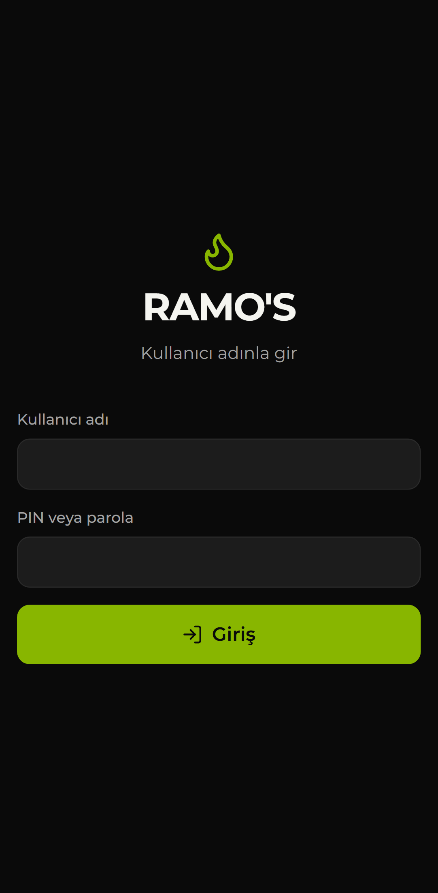 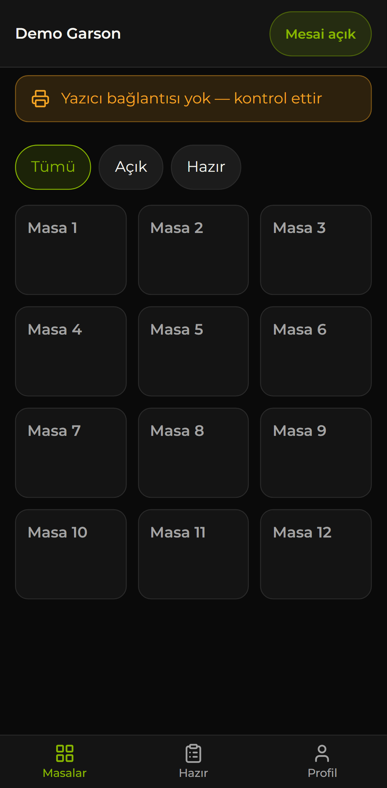

---

## 2. Yazıcıyı ağa bağlama (XP-Q80A)

Yazıcı fişleri **ağ kablosu (Ethernet)** üzerinden alır. Siparişleri yazıcıya restoran PC'sindeki yazdırma programı gönderir ([§3](#3-yazdırma-programı-restoran-pcsi)). Yazıcı ile PC aynı modeme bağlı olmalıdır.

### 2.1 Kablo

1. Yazıcının Ethernet kablosunu **modeme** (ya da modeme bağlı bir switch'e) takın. USB kablosu takılı kalabilir.
2. Yazıcıya kağıt rulosunu takın. **Termal yüz dışa** bakmalıdır; ters takılırsa fiş boş çıkar.
3. Yazıcıyı açın. Ağ girişinin ışıkları yanmalıdır.

### 2.2 Ayar fişi (self-test)

1. Yazıcıyı kapatın.
2. **FEED** tuşunu basılı tutun ve yazıcıyı açın.
3. 2–3 saniye sonra, fiş çıkmaya başlayınca tuşu bırakın.

Çıkan ayar fişinde iki şeye bakın:

- **IP Address:** Yazıcının ağ adresi. Xprinter'ın fabrika adresi `192.168.123.100`'dür.
- **Karakter tablosu listesi:** Listede **`61 = PC857`** satırı olmalıdır. Türkçe ve Almanca harfler bu tabloyla basılır.

### 2.3 Yazıcının adresini modemin ağına ayarlama

**Kolay yol:** Adres fabrika ayarında kalmış olsa da [§3](#3-yazdırma-programı-restoran-pcsi)'teki **Kurulum.cmd** yazıcıyı çoğu zaman kendisi bulur. Bunun için PC'ye yazıcının ağından ek bir adres tanımlar ("köprü"), yazıcının ayarına dokunmaz. Yalnız bu yol yeterliyse bu bölümün geri kalanını atlayabilirsiniz.

**Kalıcı ve temiz yol** (önerilir, özellikle köprü kurulduysa):

1. Modemin ağ adresini öğrenin. Örnek: modem `192.168.1.1` ise ağ `192.168.1.x`'tir.
2. Yazıcıya bu ağda boş bir adres verin (örnek `192.168.1.250`). Bunu Xprinter'ın Windows aracıyla ("Printer Test Tool", bağlantı türü **Port: NET**) yapın. Aracı çalıştıran PC yazıcıyla aynı ağda olmalıdır.
3. Modemin arayüzünde bu adresi yazıcıya **ayırın** (DHCP rezervasyonu ya da "sabit IP"). Böylece modem yeniden başlasa da adres değişmez.
4. Yeni bir ayar fişi basıp adresi kontrol edin.
5. Adres değiştiyse restoran PC'sinde **Kurulum.cmd**'yi yeniden çalıştırın.

> Adres sonradan değişirse (ör. modem yeniden başladı) yazdırma programı yazıcıya 1 dakika ulaşamayınca ağda kendisi arar. Aynı yazıcıyı donanım adresinden tanırsa yeni adrese geçer. Ağda birden fazla yazıcı varsa ve hangisi olduğundan emin olamazsa adresi değiştirmez; o zaman Kurulum.cmd'yi tekrar çalıştırın.

### 2.4 Yönetim panelinde yazıcı ayarı ve test fişi

1. Yönetim panelinde **Ayarlar → Yazıcı bağlantısı** bölümünü açın.
2. **IP adresi** alanına yazıcının adresini, **Port** alanına `9100` yazın ve **Kaydet**'e basın.
3. Aynı sayfadaki (ya da **Canlı durum** ekranındaki) **Yazıcı** kartında **Test fişi bas**'a dokunun.

Test fişi **kayıtlı** ayarlarla basılır. Yeni bir ayarı denemeden önce mutlaka **Kaydet**'e basın.

> **Önemli:** Buradaki IP adresi sitenin genel ayarıdır. Kurulum.cmd ile kurulmuş bir PC ise kendi bulduğu adresi kullanır; o PC'de adres panelden değiştirilemez. Adres değiştiyse o PC'de Kurulum.cmd'yi yeniden çalıştırın.

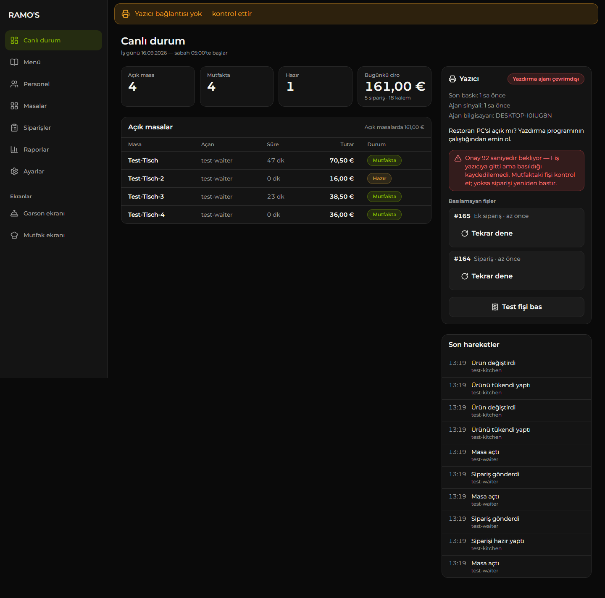

### 2.5 Karakter tablosu (bozuk harfler)

TESTDRUCK fişindeki `ÄÖÜ äöü ß · Şş Ğğ İı Çç` satırına bakın. Harfler bozuksa şu sırayla deneyin; her adımdan sonra **Kaydet** ve **Test fişi bas**:

1. **Ayarlar → Yazıcı bağlantısı → Karakter tablosu:** `CP857 · Türkçe (61) — Xprinter, önerilen`. Varsayılan budur.
2. Bozuksa: `Windows-1254 · Türkçe (91) — Xprinter`.
3. Hâlâ bozuksa **Türkçe harfleri sadeleştir** anahtarını açın (Ş→S, Ğ→G, İ→I, ı→i).

Kurulum.cmd de test fişinden sonra "Bu özel harfler düzgün basılmış mı?" diye sorar. "Hayır" derseniz yalnız o PC için **sade harf** moduna geçer (ä → ae, ß → ss, ş → s; ör. "Drehspiess", "Kuzu Sis").

Epson yazıcıda tablo numaraları farklıdır; bkz. [§2.6](#26-epson-tm-m30iii-secure-printing-ve-epos-print).

### 2.6 Epson TM-m30III (Secure Printing ve ePOS-Print)

Epson TM-m30III iki yoldan basabilir: **şifreli ham baskı (port 9143)** ya da yazıcının kendi web servisi **ePOS-Print (port 443)**. Yazıcı 9100'e de 9143'e de hiç cevap vermiyorsa (test fişi Epson TM Utility'den çıkıyor ama sistemden çıkmıyorsa) doğrudan **ePOS-Print**'e geçin — aşağıdaki "ePOS-Print" başlığı.

Avrupa'da satılan Epson TM modellerinde (ör. TM-m30III) **Secure Printing** fabrikadan açık gelir. Bu yazıcı şifresiz port `9100`'e gönderilen fişi reddeder ya da hiç basmaz; fişler **şifreli (TLS) port `9143`**'ten basılır. Yazdırma programı port `9143` görünce bağlantıyı kendiliğinden şifreli kurar. Yazıcının sertifikası yazıcının kendi ürettiği sertifikadır; program bunu yerel ağda kabul eder.

1. Restoran PC'sinde **Kurulum.cmd**'yi çalıştırın. Sihirbaz ağda `9100`'e ek olarak `9143`'ü de dener. Epson bulunursa ekranda "Epson (şifreli baskı, port 9143) bulundu" yazar ve o PC'nin ayarına `PRINTER_PORT=9143`, `PRINTER_CODEPAGE=windows1254`, `PRINTER_CODEPAGE_NUMBER=48` yazılır. Adresi elle girerseniz de `9143` yoklanır.
2. Yönetim panelinde **Ayarlar → Yazıcı bağlantısı → Yazıcı türü:** **Epson TM (şifreli)** seçin. Port `9143`, karakter tablosu `Windows-1254 · Türkçe + Almanca + € (48) — Epson` olarak dolar. **Kaydet**'e basın.
3. **Test fişi bas.** `ÄÖÜ äöü ß · Şş Ğğ İı Çç` satırı düzgün çıkmalı. Bozuksa karakter tablosunda `CP857 · Türkçe (13) — Epson`'u deneyin.

| | Xprinter | Epson TM (Secure Printing) |
|---|---|---|
| Port | `9100` (şifresiz) | `9143` (şifreli, TLS) |
| Karakter tablosu | CP857 = `61`, WPC1254 = `91` | WPC1254 = `48` (önerilen), PC857 = `13` |

> Yazıcı ile PC aynı ağda olmalıdır. Epson durum sorusuna şifreli portta cevap vermezse Yazıcı kartında durum "bilinmiyor" görünebilir; bu baskıyı engellemez. Secure Printing'i kapatıp `9100` ile basmak da mümkündür (yazıcının web ayarı, Epson Web Config), ama gerekmez.

**ePOS-Print (port 443) — 9100/9143 cevap vermiyorsa**

Bazı TM-m30III kurulumlarında yazıcı ham baskı portlarına (9100 ve 9143) hiç cevap vermez; Epson TM Utility'nin telefondan bastığı test fişi ise **ePOS-Print** yoluyla (yazıcının web servisi, HTTPS 443) çıkar. Sistem aynı yolu kullanabilir; yazıcıda hiçbir ayar gerekmez (ePOS-Print fabrikadan açıktır), internet de gerekmez.

1. Yönetim panelinde **Ayarlar → Yazıcı bağlantısı → Yazıcı türü:** **Epson TM-m30III (ePOS-Print, port 443)** seçin. Port `443`, karakter tablosu `Windows-1254 · Türkçe + Almanca + € (48) — Epson` olarak dolar. **IP adresi** yazıcının adresi (ör. `192.168.2.198`). **Kaydet**.
2. **Baskı yolu** ne ise o cihaz basar: tablet istasyonu (§2.8, uygulama **v2.2+** gerekir) ya da bilgisayar programı (§3). Her ikisi de port 443'ü görünce fişi ePOS-Print ile gönderir.
3. **Test fişi bas.** `ÄÖÜ äöü ß · Şş Ğğ İı Çç` satırı düzgün çıkmalı; bozuksa `CP857 · Türkçe (13) — Epson`'u deneyin.

Bilmeniz gerekenler:

- Port `80` aynı yolun şifresiz (HTTP) hâlidir; yazıcıda HTTPS kapalıysa kullanılabilir. Yazıcının sertifikası kendi ürettiği sertifikadır, yerel ağda doğrulanmadan kabul edilir (9143'teki gibi).
- Yazıcı kağıt bitti / kapak açık derse fiş **basılmaz** ve ekranda ilgili uyarı çıkar; sorun giderilince sıradaki fişler kendiliğinden basılır.
- Yazıcı isteğe hiç cevap vermezse (ağ kopması) fiş **basılmış sayılır** (yazıcı isteği almış olabilir; aynı fiş iki kez çıkmasın). Fiş çıkmadıysa mutfaktan **Tekrar bas**.
- **Yazıcı kartı "Durum bilinmiyor"** gösteriyorsa istasyon/program henüz durum sormamıştır; baskıyı engellemez.

### 2.7 Epson Server Direct Print (bilgisayarsız)

Epson TM-m30III (ve Server Direct Print destekleyen diğer Epson TM'ler) fişleri **bilgisayar olmadan**, internet üzerinden doğrudan sunucudan çekebilir. Yazıcı birkaç saniyede bir sunucuya "basılacak fiş var mı?" diye sorar, varsa basar ve sonucu bildirir. Restoran PC'si kapalı olsa da fiş çıkar. Teknik ayrıntılar ve henüz gerçek yazıcıda doğrulanmamış noktalar: [epson-server-direct-print.md](epson-server-direct-print.md).

**Gerekenler:** yazıcı ağa bağlı ve **internete çıkabiliyor** olmalı (modem üzerinden; restoranın içinden gelen bağlantı gerekmez, yazıcı dışarı bağlanır). Yazıcının IP adresi (ayar fişinde yazar, bkz. §2.2).

1. **Yazıcıyı ekleyin.** Yönetim panelinde **Ayarlar → Baskı yolu → Yazıcı adı** yazın (ör. "Mutfak TM-m30III") → **Yazıcı ekle**. Ekranda yazıcıya özel bir adres çıkar (`https://…/functions/v1/epson-sdp?t=…`). **Bu adres bir daha gösterilmez**: **Adresi kopyala** ile alın, bir sonraki adımda yazıcıya girin, sonra **Kaydettim, kapat**. Adres bir anahtar içerir; kimseyle paylaşmayın. Kaybolursa **Anahtarı yenile** yeni adres üretir (eskisi hemen geçersiz olur).
2. **Yazıcıda Web Config.** Aynı ağdaki bir bilgisayarın tarayıcısında `https://<yazıcının IP'si>` açın (sertifika uyarısı normaldir) ve yönetici olarak girin (varsayılan parola çoğunlukla yazıcının seri numarası). **TM-Intelligent / Web Service** ayarlarında **Server Direct Print**'i açın (menü adları yazılım sürümüne göre biraz değişebilir):
   - **Server Direct Print:** Enable
   - **Server 1 URL:** 1. adımdaki adres · **Interval:** `5` sn
   - **ID / Password:** boş kalabilir (ID'ye yazıcı adını yazmak da olur)
   - **URL Encode:** Enable
   - **Server Authentication:** önce **Disable** ile deneyin (bağlantı yine şifrelidir). **Access Test** düğmesi adresin açıldığını doğrular.
   - Uygula ve yazıcıyı yeniden başlat.
3. Birkaç saniye içinde **Ayarlar → Baskı yolu** listesinde yazıcının yanında **Bağlı** görünür (sayfa 30 sn'de bir tazelenir).
4. **Baskı yolunu seçin:** **Epson Server Direct Print** → **Baskı yolunu uygula**. Bu andan itibaren fişleri yalnız Epson yazıcı çeker.
5. **Yazıcı bağlantısı → Yazıcı türü: Epson TM** seçip **Kaydet**'e basın: karakter tablosu `Windows-1254 (48)` olur (adres/port alanları bu yolda kullanılmaz). Sonra **Test fişi bas**; `Şş Ğğ İı Çç` satırı düzgün çıkmalı.

Bilmeniz gerekenler:

- **Bilgisayar programını kaldırmak gerekmez.** Baskı yolu "Epson Server Direct Print" iken program çalışsa bile fiş basmaz (aynı fiş iki kez çıkmaz). Geri dönmek için yolu **Bilgisayar programı** yapıp uygulamanız yeterli.
- Yol "Epson Server Direct Print" iken etkin yazıcı yoksa ya da yazıcı internete çıkamıyorsa **fiş basılmaz**; siparişler kaybolmaz, sırada bekler. Garson/mutfak ekranındaki "Yazıcı bağlantısı yok" uyarısı bu durumda da çıkar (yazıcı 90 sn'dir sormadıysa).
- Kağıt biterse ya da kapak açıksa yazıcı bunu bildirir; ekranda ilgili uyarı çıkar ve fiş kısa aralıklarla yeniden denenir.
- **Pasifleştir** yazıcının fiş çekmesini hemen durdurur (adres geçerli kalır, **Etkinleştir** ile döner).

### 2.8 Tablet yazıcı istasyonu (bilgisayarsız, Android tablet)

Restorandaki **bir Android tablet** (çoğunlukla mutfak tableti) fişleri aynı Wi-Fi'daki yazıcıya **kendisi** gönderir. Bilgisayar gerekmez; Xprinter (port `9100`), şifreli Epson (port `9143`) ve Epson ePOS-Print (port `443`, uygulama v2.2+; §2.6) ile çalışır. **Uygulama v2.3+ yazıcıyı ağda kendisi bulur** (Ayarlar → Yazıcı bağlantısı → **Ağdaki yazıcıyı bul**): yazıcının IP'sini bilmek ya da bilgisayardaki kurulum sihirbazını çalıştırmak gerekmez; yazıcı modeme Wi-Fi ile de kabloyla da bağlı olabilir. Tablette **Ramo's Android uygulamasının yeni sürümü (v2)** kurulu olmalıdır ([§5.3](#53-android-uygulaması-apk)); Chrome'da ya da eski (v1) uygulamada bu anahtar görünmez.

**Gerekenler:**

- Tablet ve yazıcı **aynı Wi-Fi / modem** ağında. Yazıcının IP adresi sabit olmalı (§2.3).
- Tablette Ramo's v2 uygulaması, **mutfak** (ya da yönetici) hesabıyla giriş.
- Tablet prize takılı, ekran zaman aşımı **Hiçbir zaman** (§4.1).

**Kurulum:**

1. **Yazıcı bilgisi:** Tablette (ya da telefonda) Ramo's uygulamasına **yönetici** hesabıyla girin → **Ayarlar → Yazıcı bağlantısı → Ağdaki yazıcıyı bul** (uygulama v2.3+). 10–20 saniyede aynı ağdaki yazıcılar listelenir; her satırda yazıcının türü ve **Doğrulandı** rozeti görünür. **Bu yazıcıyı kullan** → IP adresi, Port ve Karakter tablosu kendiliğinden dolar → **Kaydet**. İstasyon bu bilgileri kullanır. Eski uygulamada ya da bilgisayardan giriyorsanız alanları elle doldurun: IP adresi, Port (`9100` Xprinter / `9143` Epson Secure Printing / `443` Epson ePOS-Print) ve Karakter tablosu → **Kaydet**.
2. **Baskı yolunu seçin:** **Ayarlar → Baskı yolu → Tablet yazıcı istasyonu** → **Baskı yolunu uygula**. Bu andan itibaren fişleri yalnız tablet basar; bilgisayar programı ve Epson Server Direct Print iş almaz.
3. **Tablette:** Ramo's uygulamasını açın → mutfak hesabıyla giriş → **Mutfak** ekranında başlığın altındaki **Yazıcı istasyonu** anahtarını **açın**. Rozet **Açık** olur; ilk fiş basılınca **Açık · son baskı 14:32** gibi saat görünür.
4. **Deneyin:** **Ayarlar → Yazıcı bağlantısı → Test fişi bas**. Birkaç saniye içinde tabletten yazıcıya gider. Türkçe harfler bozuksa §2.5.

**Bilmeniz gerekenler:**

- **Uygulama v2.1 ve sonrası arka planda da basar** (aşağıya bakın). Eski v2.0'da uygulama **açık ve ekranda** olmalıdır: kapatılırsa, arka plana alınırsa ya da tablet uyursa fiş basılmaz; siparişler kaybolmaz, sırada bekler ve uygulama öne gelince hemen basılır.
- Aynı anda **tek tablet** istasyon olsun. İki tablette anahtar açıksa ikisi de fiş alabilir (aynı fiş iki kez basılmaz, ama hangisinin bastığı karışır).
- **"Yazıcıya ulaşılamıyor"** rozeti: yazıcı kapalı, kablosu/Wi-Fi'ı kopuk ya da IP değişmiş. Yazıcıyı kontrol edin ve **Ayarlar → Yazıcı bağlantısı → Ağdaki yazıcıyı bul** ile adresi yeniden bulup kaydedin. Kağıt bittiyse ya da kapak açıksa şeridin altında **Son hata** yazar; fiş kısa aralıklarla yeniden denenir.
- **"Yazıcı adresi yok"**: Yazıcı bağlantısında IP boş. 1. adımı yapın.
- **Telefonda mobil veri açıkken:** Android, Wi-Fi'ı "internetsiz" sayarsa bağlantıları mobil şebekeye yönlendirir; o zaman yerel ağdaki yazıcıya ulaşılamaz (Epson TM Utility ise Wi-Fi'a doğrudan bağlandığı için basar). **Uygulama v2.3+** yazıcı bağlantılarını her zaman Wi-Fi / kablolu ağ üzerinden kurar. Eski sürümde mobil veriyi geçici olarak kapatın.
- Geri dönmek için baskı yolunu **Bilgisayar programı** yapıp uygulamanız yeterli; tablette anahtar açık kalsa da iş almaz. Şerit yerinde kalır, rozet **Baskı yolu farklı** der (eski sürümde şerit tamamen kayboluyordu).

**Arka planda baskı (uygulama v2.1+):**

Anahtar açıldığında tablette küçük bir **arka plan hizmeti** başlar. Uygulama arka plandayken, ekran kapalıyken, son uygulamalardan kaydırılıp kapatıldığında ve tablet yeniden açıldığında da fiş basar (giriş yapmak ya da uygulamayı açmak gerekmez; tabletin ekran kilidi/PIN'i varsa açılıştan sonra kilidi bir kez açın).

- **Kalıcı bildirim:** Hizmet çalışırken bildirim alanında sessiz bir **"Ramo's yazıcı istasyonu"** bildirimi durur: *Çalışıyor · son fiş 12:03*, *Yazıcıya ulaşılamıyor*, *Yazıcıda kağıt bitti*, *Yazıcı kapağı açık*, *Yazıcı adresi yok (Admin → Ayarlar)* ya da *Baskı yolu istasyon değil*. Bildirime dokunmak uygulamayı açar; **Durdur** hizmeti kapatır (yeniden açmak için Mutfak ekranındaki anahtar). İlk açılışta Android **bildirim izni** sorar: **İzin ver** deyin. Reddedilirse de fiş basılır, yalnız bildirim görünmez.
- **Pil ayarı:** Mutfak ekranındaki **Pil kısıtlamasını kaldır** düğmesine basın ve çıkan pencerede **İzin ver** deyin (Android: *Uygulamanın her zaman arka planda çalışmasına izin verilsin mi?*). Bazı markalar (Xiaomi, Huawei, Samsung, Oppo…) ayrıca kendi pil ayarlarıyla arka plandaki uygulamaları kapatır: **Ayarlar → Uygulamalar → Ramo's → Pil** bölümünde **Kısıtlanmamış / Arka planda çalışmaya izin ver** seçin; varsa **Otomatik başlatma**yı açın.
- **Zorla durdur yapmayın:** *Ayarlar → Uygulamalar → Ramo's → Zorla durdur* hizmeti de kapatır ve tablet yeniden başlatılsa bile uygulama bir kez elle açılana dek çalışmaz. Son uygulamalardan kaydırmak ise sorun değildir.
- **Tablet kaldırılırsa:** Yönetim panelinde **İstasyon tabletleri → Kaldır** yapılırsa tablet fiş basmayı hemen bırakır ve *"İstasyon kaydı silindi — uygulamadan yeniden açın"* bildirimi çıkar. Yeniden başlatmak için tablette anahtarı tekrar açın.

### 2.9 Baskı yolları karşılaştırması

| | Bilgisayar programı (yazdırma ajanı) | Epson Server Direct Print | Tablet yazıcı istasyonu |
|---|---|---|---|
| **Kim basar** | Restoran PC'sindeki program (§3) | Epson yazıcının kendisi (§2.7) | Ramo's uygulaması kurulu Android tablet/telefon (§2.8) |
| **Bilgisayar gerekir mi** | Evet, açık ve uyanık | Hayır | Hayır |
| **Yazıcı** | Xprinter ve Epson (9100 / 9143 / ePOS-Print 443) | Yalnız Server Direct Print destekli Epson TM (ör. TM-m30III) | Xprinter ve Epson (9100 / 9143 / ePOS-Print 443, v2.2+) |
| **Yazıcının internete çıkması** | Gerekmez (PC çıkar) | **Gerekir** | Gerekmez (tablet çıkar) |
| **Ne zaman basılmaz** | PC kapalı / uykuda | Yazıcı internete çıkamıyorsa | Tablet kapalı ya da ağ dışında; marka pil ayarı hizmeti kapatırsa (v2.0'da: uygulama ekranda değilse) |
| **Kurulum** | Kurulum.cmd (§3.2) | Web Config'e adres girmek (§2.7) | Uygulamayı kurup anahtarı açmak (§2.8) |
| **Seçim** | **Ayarlar → Baskı yolu → Bilgisayar programı** | **… → Epson Server Direct Print** | **… → Tablet yazıcı istasyonu** |

Hangi yol seçilirse seçilsin siparişler kaybolmaz: basılamayan fiş sırada bekler ve yol çalışır hâle gelince sırayla basılır. Aynı anda yalnız seçili yol fiş basar; diğerleri açık kalsa da iş almaz.

---

## 3. Yazdırma programı (restoran PC'si)

Fişleri yazıcıya restoran PC'sindeki küçük bir program gönderir. Ekranı yoktur, arka planda çalışır. **PC açık kaldığı sürece fiş basılır.** PC kapalıysa siparişler kaybolmaz; mutfak ekranında görünür, fişleri sırada bekler ve PC açılınca sırayla basılır.

### 3.1 Gerekenler

- Windows 10 ya da 11 çalışan, internete bağlı bir bilgisayar. Yazıcıyla aynı modeme bağlı olmalı (kablo ya da Wi-Fi). Misafir Wi-Fi ağı olmaz.
- **Node.js 22 veya üstü.** Kurulum yoksa kendisi kurar; Windows izin sorarsa **Evet** (Almanca Windows'ta **Ja**) deyin. Otomatik kurulamazsa açılan sayfadan **LTS** sürümünü indirip kurun ve Kurulum.cmd'yi tekrar çalıştırın.
- **Kurulum paketi:** Masaüstündeki `Ramos Yazıcı Kurulum` klasörü ya da `RamosYaziciKurulum.zip`. Zip gelirse önce sağ tıklayıp **Tümünü ayıkla** deyin; zip'in içinden çalıştırılırsa kurulum başlamaz.

> Paketteki `.env` dosyası yazıcı hesabının parolasını taşır. Klasörü yalnız işletmenin bilgisayarlarına kopyalayın. E-postayla ya da herkese açık bir yerden göndermeyin.

### 3.2 Kurulum

1. Yazıcıyı açın ve modeme bağlayın ([§2](#2-yazıcıyı-ağa-bağlama-xp-q80a)).
2. Paketteki **`Kurulum.cmd`** dosyasına **çift tıklayın**.
3. İlk soru yazıcının nasıl bağlı olduğudur: **1** kablo, **2** Wi-Fi, **3** USB, **4** bilmiyorum (Enter = 4).
4. Sihirbaz 8 adımı kendisi yürütür; sorulara cevap verin:
   1. Node.js'i kontrol eder, yoksa kurar.
   2. Bu PC'de çalışan eski yazdırma programını durdurur ve siteye yazıcı hesabıyla bağlanmayı dener. Başka bir PC'de çalışan program görürse uyarır.
   3. Yazıcıyı ağda arar. Durum sorusuna cevap vermeyen bir cihaz bulursa ona kısa bir "RAMO'S KURULUM" deneme fişi gönderir. Fiş çıktıysa **e** yazıp Enter'a basın.
   4. Yazıcı bu ağda yoksa USB bağlantısını sorar ya da fabrika ağlarında arar ("köprü", yönetici izni ister). O da olmazsa ayar fişindeki adresi sorar.
   5. Bulunan adresi bu PC'nin ayarına yazar.
   6. **TESTDRUCK** fişi basar ve özel harflerin düzgün çıkıp çıkmadığını sorar.
   7. Prize takılıyken PC'nin uykuya geçmesini kapatmayı önerir (dizüstünde kapak kapanınca uyumayı da).
   8. Programı kurar, Windows oturumu açılınca kendiliğinden başlayacak şekilde ayarlar ve siteye bağlandığını doğrular.
5. Sonunda yeşil **KURULUM TAMAM** yazısını görmelisiniz.
6. Yönetim panelinde **Canlı durum → Yazıcı** kartında durumun **Çevrimiçi** olduğunu kontrol edin ve **Test fişi bas**'a dokunun.

> **Kurulum her zaman `Kurulum.cmd` dosyasına çift tıklanarak yapılır.** Başka bir programın ya da uzaktan yardım aracının içinden başlatılan kurulum bu bilgisayarda gerçek klasöre yazılmayabilir. O zaman eski program çalışmaya devam eder ([§8](#yazıcı-eski-düzende-fiş-basıyor)).

### 3.3 Otomatik başlama ve uyku

- Program Windows'ta **"RamosPrintAgent"** adlı bir Zamanlanmış Görev olarak kurulur. **Windows oturumu açılınca** kendiliğinden başlar, çökerse 1 dakika sonra yeniden başlar. PC yeniden başladıysa oturumun açılması gerekir.
- **PC uykuya geçmemeli.** Uykudaki bilgisayar fiş basamaz. Kurulum bu ayarı sorarak kapatır. Elle yapmak için:
  - **Ayarlar → Sistem → Güç (ve pil) → Ekran ve uyku →** prize takılıyken uyku: **Hiçbir zaman**
  - Dizüstünde: **Denetim Masası → Güç Seçenekleri → Kapağı kapatınca yapılacaklar →** prize takılı: **Hiçbir şey yapma**
- Ekranın kapanması sorun değildir. Dizüstü bilgisayar **prize takılı** kalmalıdır.

### 3.4 Aynı anda tek bilgisayar

Yazdırma programı aynı anda **yalnız bir** bilgisayarda açık olmalıdır. İki bilgisayarda açık olursa sipariş hangisine düşerse orada basılır. Başka bir PC'ye geçmeden önce eski PC'de **`Kaldir.cmd`** çalıştırın.

### 3.5 Kayıtlar (loglar)

Program kayıtlarını şu klasöre yazar (Dosya Gezgini'nin adres çubuğuna yapıştırın):

```
%LOCALAPPDATA%\RamosPrintAgent\logs
```

- `agent-*.log`: Programın günlük kaydı. 7 gün saklanır, 5 MB'ta yeni dosyaya geçer.
- `console.log`: Görevin konsol çıktısı.
- `FATAL.txt`: Program art arda çöküp durduysa sebebi burada yazar.

Program ve ayar dosyası (`.env`) bir üst klasördedir: `%LOCALAPPDATA%\RamosPrintAgent`.

### 3.6 Güncelleme ve kaldırma

- **Güncelleme:** Yeni kurulum paketi gelince aynı PC'de **`Kurulum.cmd`**'ye yeniden çift tıklayın. Sihirbaz eski programı kendisi durdurur ve yenisini kurar.
- **Kaldırma:** **`Kaldir.cmd`**'ye çift tıklayın. Görevi siler, programı durdurur ve kurulum klasörünün silinip silinmeyeceğini sorar. Klasör yazıcı hesabının parolasını taşıdığı için, PC başka birine verilecekse silin.

### 3.7 Raspberry Pi / Linux alternatifi

Windows PC yerine sürekli açık duran küçük bir Linux cihazı (ör. Raspberry Pi) da kullanılabilir. Bu kurulumu geliştirici yapar; tam komutlar `deploy/ramos-print-agent.service` dosyasının başında yazar:

1. Önce Windows PC'de **Kaldir.cmd** çalıştırın (aynı anda tek bilgisayar).
2. Cihaza Node.js 22+ kurulur. Tek dosyalık program `dist/ramos-agent.mjs` (`npm run build -w apps/print-agent` ile üretilir) `/opt/ramos-print-agent/` klasörüne kopyalanır.
3. Ayar dosyası `/opt/ramos-print-agent/.env` olarak konur ve **`chmod 600`** yapılır. İçinde yazıcı hesabının bilgileri, bu cihaza özgü bir `AGENT_ID` (ör. `ramos-pi-1`) ve isteğe bağlı `PRINTER_HOST` bulunur. `PRINTER_HOST` yoksa panelde kayıtlı IP adresi kullanılır.
4. `ramos` sistem kullanıcısı oluşturulur, birim dosyası `/etc/systemd/system/` altına kopyalanır, ardından `systemctl enable --now ramos-print-agent` çalıştırılır. Kayıtlar `/var/log/ramos-print-agent` klasörüne yazılır.

---

## 4. Mutfak tableti

Önerilen: **Android tablet + Google Chrome**, yatay kullanım, sürekli şarjda.

### 4.1 İlk kurulum

1. Chrome'da **https://ramos.arxdigitalsevice.com** adresini açın ve **mutfak hesabıyla** giriş yapın.
2. Chrome menüsünden (⋮) **Uygulamayı yükle** ya da **Ana ekrana ekle**'yi seçin. Bundan sonra mutfak ekranını ana ekrandaki **Ramo's** simgesinden açın.
3. Tablet ayarları:
   - **Ekran zaman aşımı:** Ayarlar → Ekran → Ekran zaman aşımı → **Hiçbir zaman** (yoksa en uzun süre). Mutfak ekranı da ekranı açık tutmaya çalışır, ama sistem ayarı en sağlam yoldur.
   - **Ses:** Medya sesi açık; sessiz mod ve "Rahatsız etmeyin" kapalı. Yeni sipariş gelince tablet sesli uyarı verir. Yazıcıda zil yoktur.
   - Tablet prize takılı kalsın.

### 4.2 Her açılışta

Mutfak ekranı açılınca **"Mutfak ekranını başlat"** yazısı çıkar. **Başlat**'a dokunun; ses ve ekranın açık kalması ancak bu dokunuşla etkinleşir. Tablet yeniden başladıysa ya da sayfa yenilendiyse tekrar dokunun.

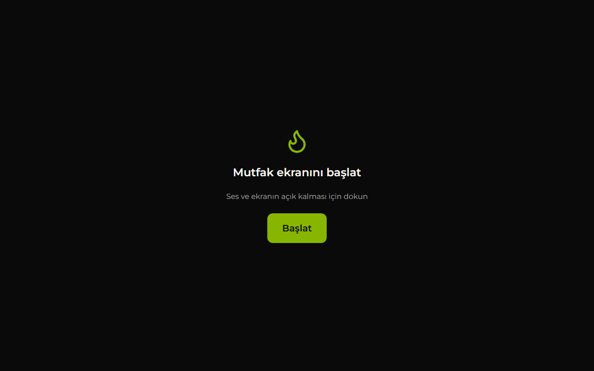 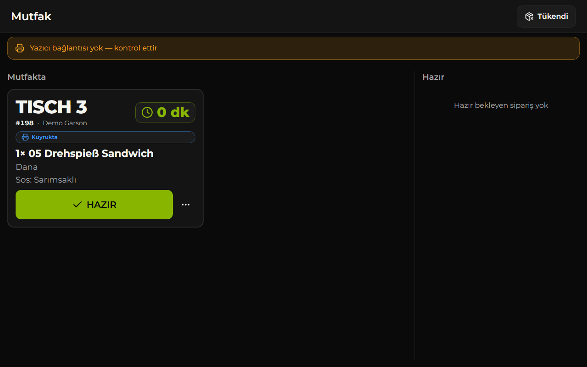

### 4.3 Mutfak ekranında neler var

- **Mutfakta** sütunu: Siparişler geliş sırasıyla kart olarak dizilir. Kartta masa, sipariş numarası, garson ve geçen süre yazar. Süre uzadıkça kart önce **BEKLİYOR**, sonra **GECİKTİ** olarak işaretlenir. Çıkarılan malzemeler kırmızı yazılır. Ek siparişte **EK SİPARİŞ**, iptal edilen kalemde **İPTAL** rozeti çıkar.
- **HAZIR:** Yemek hazır olunca dokunun. Kart sağdaki **Hazır** sütununa geçer ve garsonlara bildirim gider. Yanlışlıkla basıldıysa 30 saniye içinde **Geri al (30 sn)**'a dokunun.
- **Diğer işlemler → Tekrar bas:** Fiş kaybolduysa ya da basılamadıysa siparişi yeniden bastırır.
- **Tükendi:** Üstteki düğme bir çekmece açar. Biten ürünü işaretleyin; garson ekranında soluk ve seçilemez görünür. Ürün yeniden gelince işareti kaldırın.
- **Yazıcı istasyonu** (yalnız Ramo's v2 uygulamasında): başlığın altındaki anahtar bu tableti fiş basan cihaz yapar ([§2.8](#28-tablet-yazıcı-istasyonu-bilgisayarsız-android-tablet)). Şerit her zaman görünür; baskı yolu "Tablet yazıcı istasyonu" değilse rozet **Baskı yolu farklı** der ve nereden düzeltileceğini yazar (Admin → Ayarlar → Baskı yolu). Chrome'da anahtar yoktur; yol istasyonken Chrome'da açılan mutfak ekranı "bu cihaz fiş basamaz" uyarısı gösterir.
- **Geri tuşu (Android uygulaması v2.2+):** açık bir panel varsa (Tükendi, ürün seçenekleri, sepet…) önce onu kapatır; yoksa bir önceki ekrana döner; ana ekranda uygulamayı arka plana alır (kapatmaz). Eski sürümde geri tuşu uygulamayı doğrudan kapatıyordu.

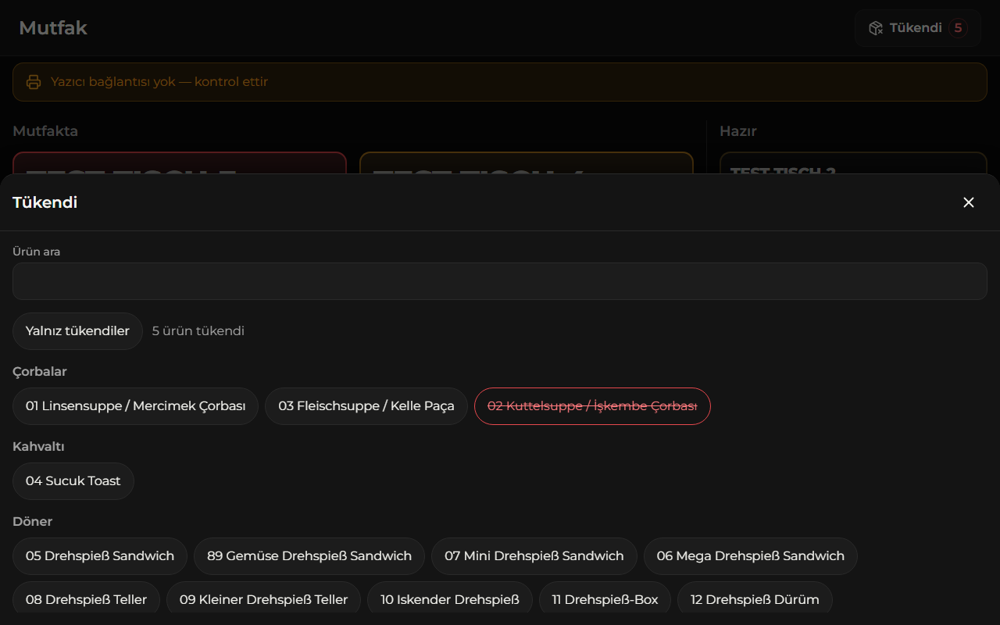 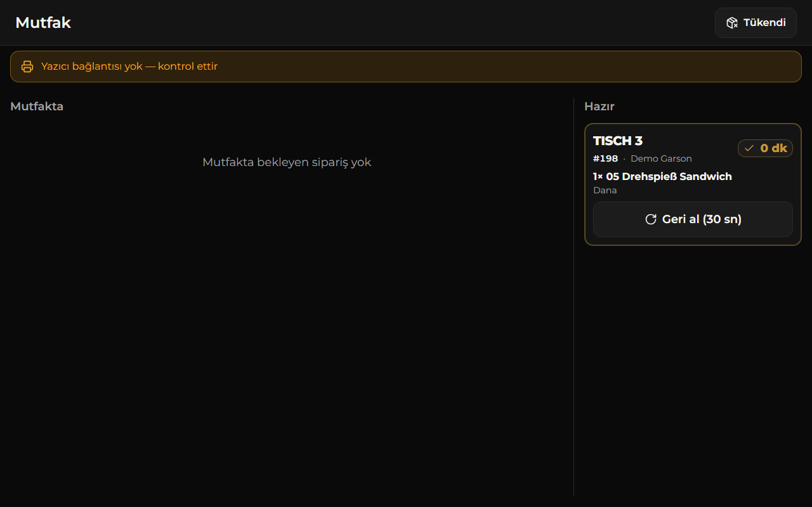

### 4.4 İsteğe bağlı: kiosk modu

Tabletin başka bir uygulamaya geçmesini engellemek için:

- **Android:** Fully Kiosk Browser uygulamasını kurun ve başlangıç adresi olarak `https://ramos.arxdigitalsevice.com/kitchen` girin.
- **iPad:** Siteyi Safari'de açıp **Paylaş → Ana Ekrana Ekle** ile ekleyin ve ana ekrandan açın. Ardından **Ayarlar → Erişilebilirlik → Rehberli Erişim**'i açın ve uygulamadayken yan tuşa üç kez basarak başlatın. Ana ekrandan açılan uygulamada ekranın açık kalması iPadOS 18.4 ve sonrasında çalışır.

---

## 5. Garson telefonları

Her garson kendi telefonunu kullanır. **Android'de Ramo's uygulaması** ([§5.3](#53-android-uygulaması-apk)), **iPhone'da ana ekrana eklenmiş site** önerilir. "Hazır" bildirimi ancak böyle kurulmuş telefonlara güvenilir biçimde gelir.

### 5.1 iPhone

iPhone için uygulama dosyası yoktur; site ana ekrana eklenir.

1. **Safari**'de **https://ramos.arxdigitalsevice.com** adresini açın (Chrome değil, Safari).
2. Alttaki **Paylaş** düğmesine (kutudan çıkan ok) dokunun.
3. **Ana Ekrana Ekle → Ekle**'ye dokunun.
4. Safari'yi kapatın. Uygulamayı **ana ekrandaki Ramo's simgesinden** açın.
5. Kullanıcı adı ve PIN ile giriş yapın.
6. Açılan **"Ramo's uygulamasını kur"** rehberinde ya da **Profil → Bildirimler** bölümünde **Bildirimleri aç**'a dokunun ve iPhone'un sorusuna **İzin Ver** deyin.

> iPhone'da bildirim yalnız **iOS 16.4 ve sonrasında** ve yalnız **ana ekrandan açılan** uygulamada çalışır. Safari sekmesinde açık siteye bildirim gelmez.

### 5.2 Android: uygulama yerine Chrome

APK kurulamıyorsa: Chrome'da siteyi açın → menü (⋮) → **Uygulamayı yükle** (ya da **Ana ekrana ekle**) → ana ekrandaki simgeden açın → giriş yapın → **Bildirimleri aç** → **İzin ver**.

### 5.3 Android uygulaması (APK)

**Ramo's** Android uygulaması canlı siteyi tam ekran açar: adres çubuğu yoktur, ana ekranda kendi simgesi vardır. İçerik doğrudan siteden gelir; sitedeki her güncelleme uygulamaya kendiliğinden yansır.

| | |
|---|---|
| Dosya | `C:\Users\PC\Desktop\Ramos APK\ramos-v2.3.0.apk` (v2.3: ağda yazıcı bulma, yazıcı bağlantısı Wi-Fi üzerinden; v2.2: geri tuşu, ePOS-Print; v2.1: arka planda baskı) |
| Uygulama adı / paket | Ramo's / `com.arxdigital.ramos` |
| Açtığı adres | https://ramos.arxdigitalsevice.com |

**v2'de ne değişti:** Uygulama siteyi artık Chrome'la değil **kendi içinde** açar. Bildirimler **Firebase** üzerinden gelir (Chrome gerekmez; Firebase kurulumu: [§5.5](#55-android-bildirimleri-için-firebase-bir-kerelik)) ve tablet **yazıcı istasyonu** olabilir ([§2.8](#28-tablet-yazıcı-istasyonu-bilgisayarsız-android-tablet)).

**Telefona kurulum (ilk kez):**

1. APK dosyasını telefona gönderin (USB kablosuyla kopyalayarak, bulut klasörüyle ya da kendinize mesaj olarak).
2. Telefonda dosyaya dokunun. Android izin isterse **Bilinmeyen kaynaklardan yüklemeye izin ver** (ya da "Bu kaynaktan izin ver") anahtarını, dosyayı açan uygulama için (Dosyalarım, Chrome vb.) açın ve geri dönün.
3. **Yükle**'ye dokunun. Google Play Protect bir uyarı gösterirse ayrıntılardan **Yine de yükle**'yi seçin.
4. Uygulamayı açın ve kullanıcı adı + PIN ile giriş yapın.
5. Kurulum rehberinde ya da **Profil → Bildirimler** bölümünde **Bildirimleri aç**'a dokunun ve Android'in sorusuna **İzin ver** deyin.
6. Pil ayarı (bildirimlerin gecikmemesi için önerilir): **Ayarlar → Uygulamalar → Ramo's → Pil → Kısıtlanmamış**.

**v1'den v2'ye geçiş (eski uygulama kurulu telefon ve tabletler):**

1. `ramos-v2.0.0.apk`'yı cihaza gönderip dokunun → **Güncelle** (ya da **Yükle**). **Eski uygulamayı silmeyin**: v2 aynı paket adı ve aynı imzayla hazırlandığı için eskisinin **üzerine** kurulur.
2. Uygulamayı açın. Uygulama artık kendi içinde çalıştığı için **bir kez yeniden giriş** istenebilir (kullanıcı adı + PIN).
3. **Profil → Bildirimler → Bildirimleri aç** → **İzin ver**. Eski (Chrome) bildirim kaydı v2'de kullanılmaz; bu adım her telefonda bir kez gerekir.
4. Durum **"Bildirimler bu sürümde kapalı"** görünüyorsa APK Firebase dosyası olmadan derlenmiştir: uygulama normal çalışır, yalnız bildirim gelmez. Firebase kurulduktan sonra üretilen yeni APK'yı aynı şekilde üzerine kurun ([§5.5](#55-android-bildirimleri-için-firebase-bir-kerelik)).

> "Uygulama yüklenmedi" / "paket çakışıyor" hatası çıkarsa cihazdaki uygulama başka bir anahtarla imzalanmıştır. O cihazda eski uygulamayı silip v2'yi kurun: yeniden giriş ve bildirim izni gerekir; siparişler sunucuda olduğu için hiçbir şey kaybolmaz.

**Güncelleme:** Menü, ekranlar ve düzeltmeler siteden geldiği için APK'yı yeniden kurmak gerekmez. Yeni APK yalnız uygulamanın adı, simgesi ya da Android tarafı (bildirim, yazıcı eklentisi) değişince üretilir (Ek A.3). Yeni APK eskisinin üzerine kurulur, veriler silinmez.

> **İmza anahtarı:** Uygulama, `C:\Users\PC\Desktop\Ramos APK` klasöründeki `ramos-release.keystore` ile imzalanır (parolası aynı klasördeki anahtar notunda). Bu dosyalar **repoda yoktur**. Kaybedilirse cihazlardaki uygulamaya güncelleme kurulamaz: uygulama silinip yeni anahtarla imzalanmış APK kurulmak zorunda kalınır. Klasörün bir yedeğini güvenli bir yerde (ör. şifreli USB bellek) saklayın.

### 5.4 Giriş, mesai ve dil

- **Giriş:** Kullanıcı adı ve **PIN veya parola**. Hatalıysa "Kullanıcı adı veya PIN hatalı" yazar; PIN'i unutan garsona yönetici yeni PIN verir ([§6.1](#61-personel)).
- **Mesai:** Üstteki düğme **Mesai açık / Mesai kapalı** durumunu gösterir. Mesai kapalıyken turuncu bir şerit çıkar; **Mesaiye başla**'ya dokunun.
  - "Hazır" bildirimi **yalnız mesaisi açık** garsonlara (ve yöneticilere) gider.
  - Mesai her gün iş günü başında (varsayılan 05:00) kendiliğinden kapanır. Her vardiya başında **Mesaiye başla**'ya dokunun.
  - Vardiya bitince **Profil → Mesaiyi bitir**.
- **Dil:** **Profil → Dil** ile Türkçe ya da Almanca. Mutfak fişi her zaman Almanca basılır.
- **Çıkış:** **Profil → Çıkış**. Paylaşılan bir telefonda vardiya sonunda çıkış yapın.

### 5.5 Android bildirimleri için Firebase (bir kerelik)

v2 uygulaması "Hazır" bildirimlerini Google'ın ücretsiz **Firebase Cloud Messaging** hizmetiyle alır. Bunun için işletmeye ait bir Firebase projesi ve iki dosya gerekir. Hesabı açıp dosyaları indirme işini **siz** yaparsınız (işletmenin Google hesabıyla); dosyaları geliştirici bağlar.

1. Bilgisayarda **https://console.firebase.google.com** adresini açın ve işletmenin Google hesabıyla giriş yapın.
2. **Proje oluştur** (Create a project) → proje adı örneğin `ramos-siparis` → Google Analytics sorulursa **kapalı** bırakabilirsiniz → **Proje oluştur**.
3. Proje açılınca **Uygulama ekle → Android** simgesine tıklayın:
   - **Android paket adı:** `com.arxdigital.ramos` (harfi harfine böyle)
   - **Uygulama takma adı:** `Ramo's` (isteğe bağlı) · **SHA-1:** boş bırakın
   - **Uygulamayı kaydet**.
4. Sonraki adımda **`google-services.json`** dosyasını **indirin**. Firebase'in gösterdiği "SDK ekle" gibi diğer adımları atlayın (İleri → İleri → Konsola devam).
5. Sol üstteki dişli çark → **Proje ayarları** → **Hizmet hesapları** (Service accounts) sekmesi → **Yeni özel anahtar oluştur** (Generate new private key) → **Anahtar oluştur**. Bir **JSON dosyası** iner (adı `ramos-siparis-firebase-adminsdk-….json` gibi).
6. Bu **iki dosyayı** şu klasöre koyun (klasör yoksa oluşturun): `C:\Users\PC\Desktop\Ramos APK\firebase\`
   - `google-services.json`
   - hizmet hesabı JSON dosyası (adını değiştirmenize gerek yok)
7. Geliştiriciye (Claude'a) **"Firebase dosyaları klasörde"** diye haber verin. Geliştirici yeni APK'yı üretir ve sunucuya bildirim anahtarını ekler; sonra cihazlara yeni APK kurulur ([§5.3](#53-android-uygulaması-apk)).

> **Bu dosyaları kimseyle paylaşmayın.** Özellikle hizmet hesabı JSON'u, projeniz adına bildirim gönderme yetkisi verir: e-postaya, mesaja, sohbete ya da bulut paylaşımına koymayın; repoya da girmez. Sızdığını düşünürseniz Firebase → Proje ayarları → Hizmet hesapları'ndan anahtarı silip yenisini oluşturun ve geliştiriciye haber verin.

---

## 6. Yönetici: ilk adımlar

Bilgisayarda **https://ramos.arxdigitalsevice.com** adresini açın ve yönetici kullanıcı adınızla (**`ramo`**) ve parolanızla girin. Parola hiçbir dosyada saklanmaz. Unutulursa başka bir yönetici **Personel → PIN sıfırla** ile yeni parola verebilir. Bu yüzden **ikinci bir yönetici hesabı** açmanız önerilir.

Soldaki menü: **Canlı durum · Menü · Personel · Masalar · Siparişler · Raporlar · Ayarlar · Denetim kaydı**. Altındaki **Ekranlar** başlığından **Garson ekranı** ve **Mutfak ekranı** açılır; yönetici de sipariş alabilir ve HAZIR'a basabilir. Telefonda menü **Menüyü aç** düğmesindedir.

**Canlı durum** ekranı açık masa, mutfakta ve hazırda bekleyen sipariş sayısını, bugünkü ciroyu, açık masaları, **Yazıcı** kartını ve son hareketleri gösterir.

### 6.1 Personel

1. **Personel → Personel ekle**.
2. **Ad**, **Kullanıcı adı** (3–32 karakter: küçük harf, rakam, `.` `_` `-`), **Rol** (Garson / Mutfak / Yönetici) ve **Dil** alanlarını doldurun.
3. Garson ve mutfak için **PIN**: 6–12 haneli rakam. Yönetici için **Parola**: en az 10 karakter.
4. Kullanıcı adını ve PIN'i personele **yüz yüze** verin. Mesajla göndermeyin.

- **PIN sıfırla:** Unutulan PIN yerine yenisini verir.
- **Pasifleştir / Aktifleştir:** İşten ayrılan kişi **pasifleştirilir**; silme yoktur. Pasif hesap uygulamaya giremez, etkisi anında başlar. Kendi hesabınızı ve son aktif yöneticiyi pasifleştiremezsiniz.
- Mesaide olan personelin yanında **Mesaide** yazar.
- **Test hesabı** etiketli hesaplar (`test-…`, `demo-garson`, `demo-mutfak`) gerçek personel değildir. Temizliği için bkz. Ek A.5.

### 6.2 Masalar

Sistem **Tisch 1–12** ile başladı. Gerçek masa sayısına göre düzenleyin:

1. **Masalar → Masa ekle**.
2. Masa adını **Almanca** yazın (ör. `Tisch 13`). Türkçe ekranda otomatik olarak "Masa 13" görünür.
3. Kullanılmayan masanın **Kullanımda** anahtarını kapatın; garson ekranından kalkar. Açık hesabı olan masa kapatılamaz, önce masayı kapatın.
4. **Kaydet**.

### 6.3 Menü

**Menü** altındaki sekmeler: **Ürünler · Kategoriler · Malzemeler · Seçim grupları · Toplu atama · Toplu görsel**.

- **Ürün düzenleme:** Numara, ad, açıklama, fiyat ya da seçenekler (ör. Hähnchen / Kalb), alerjen kodları, çıkarılabilir malzemeler, seçim grupları, **Satışta** ve **Tükendi** anahtarları. Altta **Fiş önizleme** fişin nasıl basılacağını gösterir. Menüden kalkacak ürün **Arşivle** ile kaldırılır; geçmiş siparişler olduğu gibi kalır.
- **Kategoriler:** Almanca/Türkçe ad, sıra (yukarı/aşağı), **İçecek** işareti. İçecekler fişte en sonda basılır.
- **Malzemeler:** Çıkarılabilir malzemelerin Almanca (fişte) ve Türkçe (ekranda) adları.
- **Seçim grupları:** Sos, garnitür gibi seçimler; en az/en çok seçim sayısı, fiyat farkı, varsayılan seçenek.
- **Toplu atama:** Bir malzemeyi ya da seçim grubunu seçili ürünlere tek seferde bağlar. Aynı işi tekrar yapmak güvenlidir.

**Menüdeki açık noktalar** (ilk iş kontrol edin; ayrıntı: [`docs/menu/ramos-menu-data.md` §6](menu/ramos-menu-data.md)):

1. 57/58 Adana, 59/60 Kuzu Şiş, 61/62 Tavuk Şiş: Ad ve açıklama aynı, fiyat farklı. Menüdeki gibi girildi; aradaki fark netleşmeli.
2. 22 Lahmacun Teller mit Drehspieß: Tek fiyat var, et seçimi var mı?
3. "Burger & Calamaris" başlığında Calamari ürünü yok.
4. 48/49 salata açıklamaları ve 52 Hähnchen Salat malzemeleri eksik olabilir.
5. 43 Pizza Spezial açıklaması tekrarlı yazılmış.
6. Grill ve Burger malzeme setleri tahminle girildi.
7. Calzone'da "Jeder weitere Belag +0,70" geçerli mi?
8. Sıcak içecekler (Çay, Kaffee) menüde yok.
9. Alerjen lejantı taslak; işletmenin kendi lejantıyla karşılaştırılmalı (**Ayarlar → Alerjen lejantı**).
10. Menü numaraları kasadaki numaralarla aynı mı?

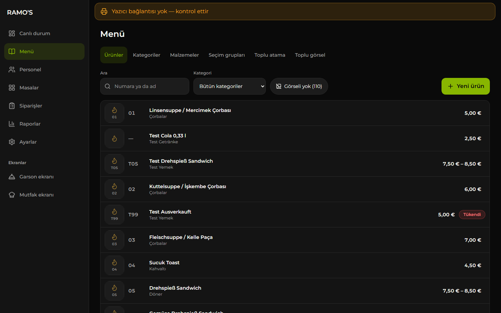

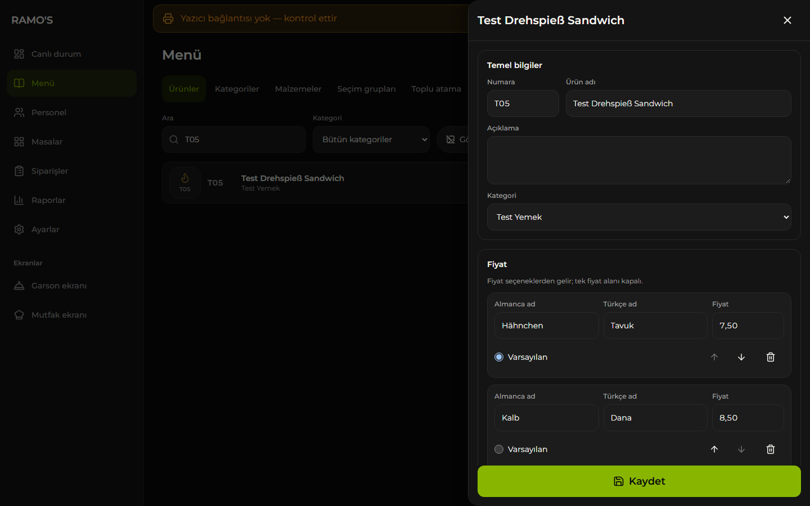

### 6.4 Ürün görselleri

Başlangıçta hiçbir üründe görsel yoktur; ekranda düzgün bir yer tutucu görünür.

- **Toplu yükleme (önerilir):** **Menü → Toplu görsel**. Dosya adlarını ürün numarası yapın: `05.jpg`, `71a.webp`, `M1.png`. Dosyaları bırakın; eşleşen ve eşleşmeyen dosyalar listelenir. **Yükle**'ye basın.
- **Tek ürün:** Ürünü açın → **Görsel** bölümü → **Görsel seç**, **Değiştir** ya da **Kaldır**.
- Desteklenen türler JPG, PNG ve WebP, en fazla 5 MB. Görseller yüklenirken küçültülür.
- **Ürünler** listesindeki **Görseli yok (N)** süzgeci eksik görselleri gösterir.
- Orijinal görsellerin bir kopyasını bilgisayarda saklayın; gecelik yedek görselleri kapsamaz ([§11](#11-yedekler-ve-geri-yükleme)).

### 6.5 Tükendi

Mutfak ekranındaki **Tükendi** düğmesinden ya da **Menü → ürün → Tükendi** anahtarından işaretlenir. Garson ekranında ürün soluk görünür ve "Tükendi" yazar. Ürün yeniden gelince işareti kaldırmayı unutmayın.

### 6.6 Siparişler

**Siparişler** ekranında tarih aralığı ve **Masa / Garson / Durum** süzgeçleri vardır. Bir siparişe dokununca sağda ayrıntı açılır:

- **Kalemler** ve toplam tutar. Masa hâlâ açıksa kalem **İptal** edilebilir.
- **Zaman çizelgesi:** Sipariş verildi → Hazır bildirildi → Teslim edildi.
- **Fişler:** Her fişin durumu ve deneme sayısı. **Fişi göster** ile fiş önizlenir, **Tekrar bas** ile yeniden sıraya alınır, basılamayan fişte **Tekrar dene** çıkar.

### 6.7 Raporlar ve CSV

1. **Raporlar**'da **Bugün · Dün · Son 7 gün · Bu ay** düğmelerinden birini seçin ya da başlangıç ve bitiş tarihi girin (en fazla 31 gün).
2. Ekranda şunlar görünür: **Sipariş**, **Kalem**, **Ciro**, **İptal edilen kalem**, **Garsonlar**, **En çok satan 10 ürün**, **Saatlik dağılım**.
3. **CSV indir**, `ramos-bestellungen-<başlangıç>_<bitiş>.csv` dosyasını indirir. Dosya Excel'de (Almanca bölge ayarıyla) doğrudan açılır. Her satır bir kalemdir, sütun adları Almancadır (Datum, Uhrzeit, Bestellung, Tisch, Kellner, Artikel, Einzelpreis, Summe, Storno-Grund …). Muhasebeci için bu dosyayı kullanın.

> Ciro, sistemdeki **liste fiyatlarıyla** hesaplanır. Kasadaki gerçek tahsilatın yerini tutmaz.

İş günü, **Ayarlar → Genel → İş günü başlangıcı** saatinde başlar (varsayılan 05:00). Bu saatten önce alınan siparişler önceki güne yazılır.

### 6.8 Ayarlar

| Bölüm | İçerik |
|---|---|
| **Genel** | Restoran adı, İş günü başlangıcı |
| **QR menü** | Müşteri menüsünün bağlantısı, QR önizlemesi ve **SVG indir (10 × 10 cm)** ([§6.10](#610-qr-menü-müşteriler-için)) |
| **Mutfak fişi** | Fişin **Başlık** ve **Alt yazı** metinleri, örnek siparişle önizleme |
| **Baskı yolu** | Fişleri kim basar: Bilgisayar programı, Epson Server Direct Print ya da Tablet yazıcı istasyonu ([§2.9](#29-baskı-yolları-karşılaştırması)); kendi **Baskı yolunu uygula** düğmesi vardır |
| **Yazıcı bağlantısı** | Yazıcı türü (Xprinter 9100 / Epson şifreli 9143 / Epson ePOS-Print 443 / Özel), IP adresi, Port, Karakter tablosu, Türkçe harfleri sadeleştir ([§2.4](#24-yönetim-panelinde-yazıcı-ayarı-ve-test-fişi), [§2.6](#26-epson-tm-m30iii-secure-printing-ve-epos-print)); Yazıcı kartı ve **Test fişi bas** |
| **Hızlı notlar** | Garsonun ürün notuna tek dokunuşla eklediği kısa notlar (Almanca fişte, Türkçe ekranda) |
| **İptal sebepleri** | Kalem iptalinde seçilen sebepler; Almancası iptal fişine basılır |
| **Alerjen lejantı** | Alerjen ve katkı maddesi kodları |

Değişikliklerden sonra **Kaydet**'e basın. Ayarlar aynı anda başka bir cihazda değiştirildiyse ekran uyarır; **Yeniden yükle** ile güncel hâli görün.

### 6.9 Denetim kaydı

Kimin ne zaman ne yaptığını gösterir: masa açma/kapatma, sipariş, HAZIR, teslim, iptal, tükendi, menü ve ayar değişiklikleri, personel işlemleri. **İşlem** ve **Kayıt türü** süzgeçleriyle daraltılır, **Ayrıntıyı göster** ile kaydın ayrıntısı açılır.


### 6.10 QR menü (müşteriler için)

Müşteri masadaki QR kodu telefonuyla okutur ve **giriş yapmadan** menüyü görür: kategoriler, ürün görseli, adı ve fiyatı. Ürüne dokununca büyük görsel, açıklama ve alerjenler açılır. Sipariş, sepet ya da seçim yoktur — yalnız incelenir.

1. **Ayarlar → QR menü** bölümünü açın. **Menüyü aç** ile müşterinin göreceği sayfayı kontrol edin.
2. **SVG indir (10 × 10 cm)** ile `ramos-qr-menu-10cm.svg` dosyasını indirin.
3. Dosyayı matbaaya ya da yazıcıya verin: **ölçekleme yapmadan (%100)** basıldığında kod tam 10 × 10 cm çıkar. Vektör olduğu için büyütülse de bulanıklaşmaz.
4. Basılı kodu masalara koyun. Bir kez basmak yeter.

Bilinmesi gerekenler:

- Görsel, fiyat, yeni ürün ve **Tükendi** değişiklikleri menüye kendiliğinden yansır; kodu yeniden basmak gerekmez. Tükenen ürün menüde **Tükendi** rozetiyle görünür.
- Sayfa telefonun diline göre açılır; müşteri üstten **Deutsch / Türkçe / English / العربية** seçebilir (Arapça sağdan sola). Kategori adları ve sayfa metinleri dört dildedir; **ürün adları ve açıklamaları Almancadır**.
- Kategorilerin İngilizce ve Arapça adları **Menü → Kategoriler**'de düzenlenir; boş bırakılırsa Almanca ad görünür.
- Kod sitenin adresini taşır (`…/menu`). Alan adı değişirse QR kodu yeniden indirip basın.

---

## 7. Günlük akış

### 7.1 Açılış

1. Restoran PC'si açık ve Windows oturumu açık olmalı. Yazıcı açık ve kağıtlı olmalı.
2. Mutfak tabletinde Ramo's'u açın ve **Başlat**'a dokunun.
3. Her garson telefonunda **Mesaiye başla**'ya dokunur.
4. Hiçbir ekranda "Yazıcı…" şeridi yoksa hazırsınız.

### 7.2 Sipariş → fiş → HAZIR → teslim → ödeme → masayı kapat

1. **Garson:** **Masalar** → masaya dokun → **Sipariş ekle**.
2. Ürünü üstteki aramadan numarasıyla ("05", "71a", "M1") ya da adıyla bulun ya da kategori düğmelerinden seçin. Satıra dokununca ürün kartı açılır:
   - **Seçenek** (ör. Hähnchen / Kalb) ve zorunlu seçimler
   - **Malzemeler — çıkarmak için dokun.** Çıkarılan malzeme kırmızı "ÇIKAR" olur, fişte `OHNE` satırına basılır.
   - Sos, ekstralar, **Not**, gerekirse **Ekstra ücret** (menüde olmayan istek, ör. ekstra peynir)
   - Adet → **Sepete ekle**
3. Üstteki sepete dokunun, kalemleri kontrol edin → **Mutfağa gönder** → **Onayla ve gönder**. "Mutfağa gönderildi · #067" yazısı çıkar.
4. **Mutfak:** Sipariş tablette kart olarak görünür, fiş yazıcıdan çıkar. Yemek hazır olunca **HAZIR**.
5. **Garson:** Telefona "Masa 12 · #047 hazır" bildirimi gelir; **Hazır** sekmesinde rozet çıkar. Uygulama açıksa üstte uyarı çıkar ve ses çalar. Yemeği götürün ve **Teslim edildi**'ye dokunun.
6. Müşteri hesabı isteyince: masa → **Hesap** → **Hesap özeti**. Tutarı kasaya girin; **ödeme kasada alınır**, sistem fiş basmaz.
7. Ödeme alınınca: masa → **Masayı kapat** → **Evet, kapat**. Mutfakta hâlâ hazırlanan sipariş varsa masa yine kapanır; sipariş mutfak ekranında kalır ve hazır olunca Hazır listesine düşer.

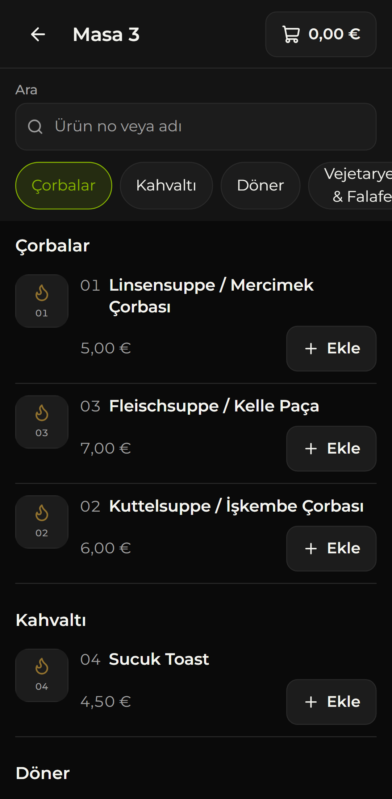 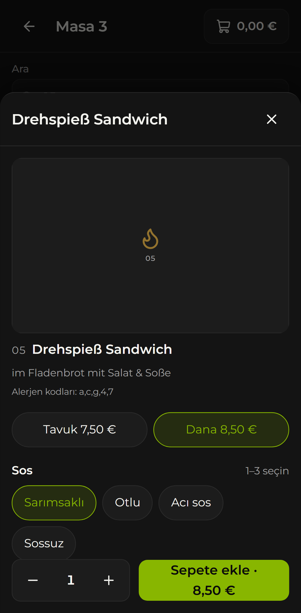 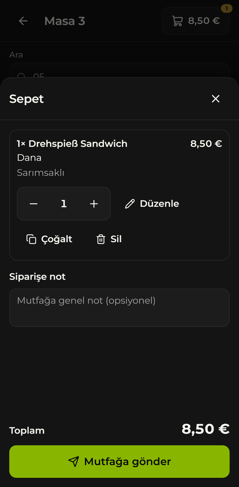 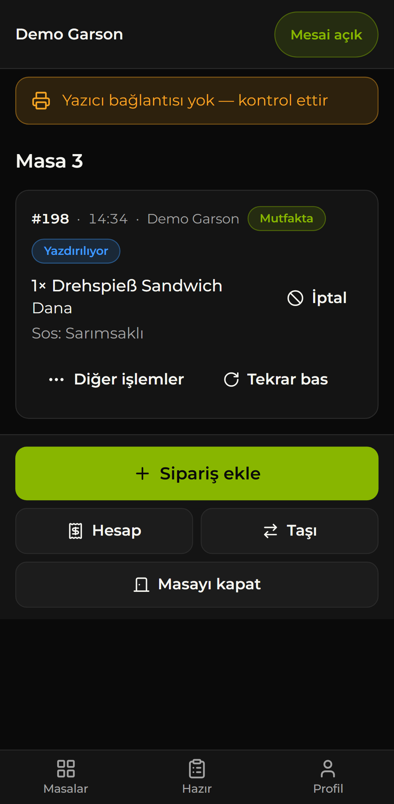 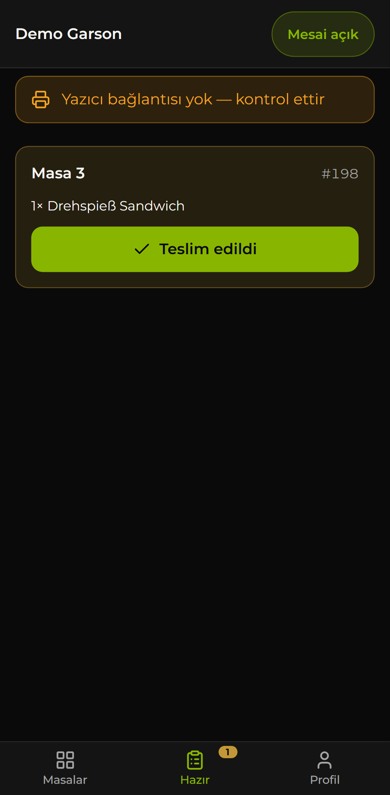 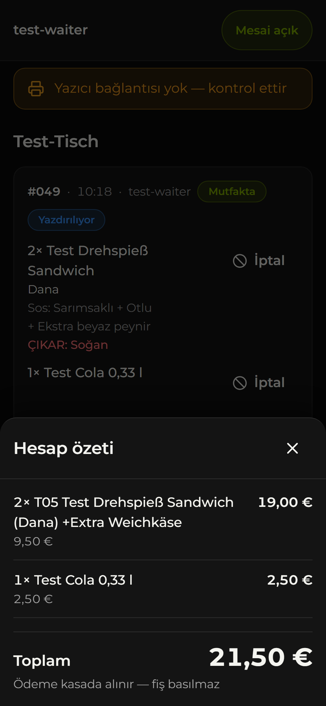

### 7.3 Ek sipariş

Aynı masada tekrar **Sipariş ekle**. Mutfak ekranında **EK SİPARİŞ** rozeti çıkar, fişte `NACHBESTELLUNG` basılır.

### 7.4 Kalem iptali

1. Masa detayında kalemin yanındaki **İptal**'e dokunun.
2. **Sebep** seçin (listede yoksa sebebi kısaca Almanca yazın) → **İptal et**.
3. Sipariş mutfakta ya da hazırda bekliyorsa mutfağa **STORNO** fişi basılır ve mutfak ekranında kalem "İPTAL" olarak görünür.

İptal edilen kalem silinmez; hesaptan düşer, denetim kaydında ve raporlarda görünür.

### 7.5 Masa taşıma

Masa detayı → **Taşı** → boş bir masa seçin → **"… masasına taşı"**. Mutfağa `TISCHWECHSEL` fişi basılır. Hiç boş masa yoksa önce bir masayı kapatın.

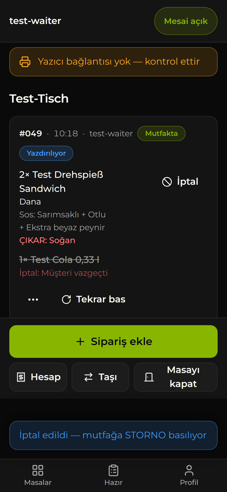 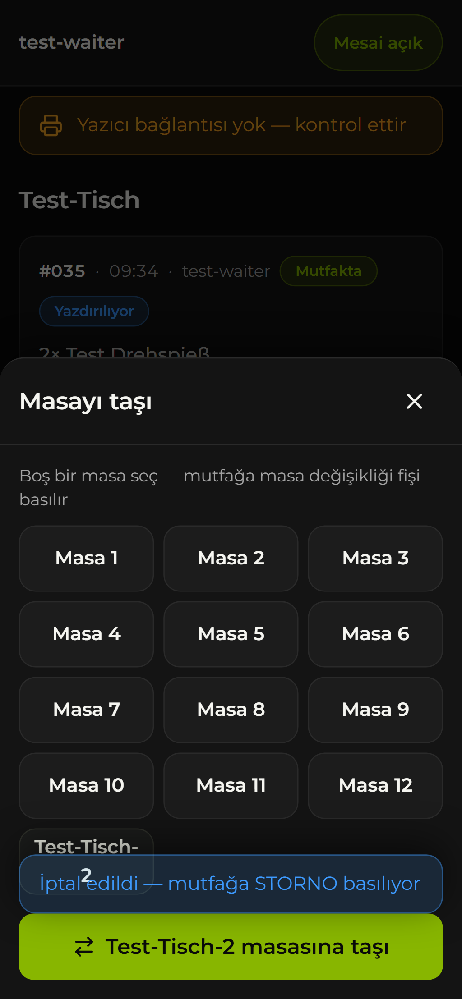

### 7.6 Fişi yeniden bastırma

Fiş kaybolduysa ya da okunmuyorsa masa detayında siparişin ya da mutfak ekranında kartın **Diğer işlemler → Tekrar bas** seçeneğine dokunun. Fişin üstünde `NACHDRUCK` yazar, içerik ilk fişin aynısıdır.

### 7.7 Kapanış

- Garsonlar **Profil → Mesaiyi bitir** (unutulursa mesai iş günü başında kendiliğinden kapanır).
- Açık masa kalmadığını **Canlı durum** ekranından kontrol edin.
- Restoran PC'sini **kapatmamanız** önerilir: kapalı kalırsa fişler bir sonraki açılışa kadar basılmaz ve uzun süre kapalı kalması veritabanını uyutabilir ([§10](#10-tatil-notu)).

---

## 8. Sorun giderme

### "Yazıcı bağlantısı yok — kontrol ettir"

Garson ve mutfak ekranında turuncu şerit olarak, yönetim panelinde **Yazdırma ajanı çevrimdışı** olarak görünür. Restoran PC'sindeki yazdırma programından 90 saniyedir haber alınamıyor demektir.

1. Restoran PC'si açık mı, uykuda mı? Windows oturumu açık mı? Uyandırın ya da oturum açın.
2. PC'nin interneti var mı?
3. 1–2 dakika bekleyin; **Canlı durum → Yazıcı** kartında "Ajan sinyali" güncellenmeli.
4. Düzelmezse PC'de **Kurulum.cmd**'yi tekrar çalıştırın. Sorun sürerse `%LOCALAPPDATA%\RamosPrintAgent\logs` klasöründeki `FATAL.txt` ve son `agent-*.log` dosyasını geliştiriciye iletin.

Bu sırada siparişler **kaybolmaz**: mutfak ekranında görünür, fişler sırada bekler ve program çalışınca sırayla basılır.

### Tablet istasyonu fiş basmıyor

Yalnız baskı yolu **Tablet yazıcı istasyonu** iken ([§2.8](#28-tablet-yazıcı-istasyonu-bilgisayarsız-android-tablet)):

1. Mutfak ekranındaki **Yazıcı istasyonu** anahtarı açık mı? Uygulama **v2.1+** ise bildirim çubuğunda *Ramo's yazıcı istasyonu* görünmeli; görünmüyorsa uygulamayı bir kez açın ve pil ayarını kontrol edin (§2.8, *Arka planda baskı*). Eski **v2.0**'da uygulama açık ve ekranda olmalı, arka plandayken basılmaz.
2. Rozet **Yazıcıya ulaşılamıyor** diyorsa: yazıcı açık mı, tablet ve yazıcı aynı Wi-Fi'da mı? Uygulama v2.3+ ise **Ayarlar → Yazıcı bağlantısı → Ağdaki yazıcıyı bul**: yazıcı listede çıkıyorsa **Bu yazıcıyı kullan → Kaydet** (IP/port yanlıştı); çıkmıyorsa yazıcı ağda değildir (kablo/Wi-Fi/modem). Telefonda mobil veri açıksa ve uygulama v2.3'ten eskiyse mobil veriyi kapatıp deneyin.
3. Rozet **Baskı yolu farklı** diyorsa: Admin → **Ayarlar → Baskı yolu → Tablet yazıcı istasyonu → Baskı yolunu uygula**. (Anahtar açık kalsa da bu yolda tablet iş almaz.)
4. Şerit hiç görünmüyorsa tablette Ramo's **uygulaması** değil Chrome açıktır: anahtar yalnız uygulamada (v2+) görünür. Chrome'daki mutfak ekranı yol istasyonken "bu cihaz fiş basamaz" uyarısı gösterir.
5. Epson TM-m30III ile rozet **Yazıcıya ulaşılamıyor** diyor ama Epson TM Utility test fişi basıyorsa: yazıcı ham portlara (9100/9143) cevap vermiyordur. **Ayarlar → Yazıcı bağlantısı → Yazıcı türü: Epson TM-m30III (ePOS-Print, port 443)** → Kaydet (uygulama v2.2+; [§2.6](#26-epson-tm-m30iii-secure-printing-ve-epos-print)).

Siparişler kaybolmaz; istasyon çalışınca sırayla basılır.

### Android uygulamasında geri tuşu çalışmıyor / uygulama kapanıyor

Uygulama **v2.2** öncesinde geri tuşu bir önceki ekrana dönmek yerine uygulamayı kapatıyordu. Çözüm: cihaza `ramos-v2.2.0.apk` (ya da daha yenisini) kurun ([§5.3](#53-android-uygulaması-apk)). v2.2'de geri tuşu önce açık paneli kapatır, sonra bir önceki ekrana döner; ana ekranda uygulamayı arka plana alır.

### "Yazıcıya ulaşılamıyor — kablosunu kontrol et"

Program çalışıyor ama yazıcıya ulaşamıyor.

1. Yazıcı açık mı, kağıt ve kapak tamam mı?
2. Ethernet kablosu modeme takılı ve ışıkları yanıyor mu?
3. Modem yeniden başladıysa yazıcının adresi değişmiş olabilir. Program 1 dakika içinde yazıcıyı ağda kendisi arar. Bulamazsa ayar fişini basın ([§2.2](#22-ayar-fişi-self-test)) ve Kurulum.cmd'yi tekrar çalıştırın.

### "Yazıcıda kağıt bitti — kağıt tak" / "Yazıcı kapağı açık — kapağı kapat"

Yeni rulo takın (termal yüz dışa) ve kapağı tam kapatın. Bekleyen fişler **kendiliğinden** basılır.

### "Basılamayan fiş var — tekrar dene" (Basılamadı)

Fiş 6 denemede basılamadı.

1. Önce sebebi giderin (PC, kablo, kağıt).
2. **Canlı durum → Yazıcı → Basılamayan fişler** listesinde her fiş için **Tekrar dene**'ye dokunun. Garson ve mutfak ekranındaki **Tekrar bas** da kullanılabilir.

### "Yazdırma onayı takıldı"

Fiş yazıcıya gönderildi ama basıldığı kaydedilemedi. Mutfaktaki fişi kontrol edin. Fiş çıkmadıysa siparişi **Tekrar bas** ile yeniden bastırın; çıktıysa bir şey yapmayın.

### Yazıcı eski düzende fiş basıyor

**Neden:** Restoran PC'sindeki yazdırma programı eski sürümle çalışıyor. Yeni fiş düzeni ona ulaşmamış.

1. En güncel kurulum paketindeki (masaüstündeki `Ramos Yazıcı Kurulum` klasörü) **`Kurulum.cmd`** dosyasına **çift tıklayın**. Soruları cevaplayın; sihirbaz eski programı kendisi durdurur ve yenisini kurar. Sonda yeşil **KURULUM TAMAM** çıkmalı.
2. Yönetim panelinde **Yazıcı** kartından **Test fişi bas**.
3. Yeni düzende şunlar görünür: en üstte büyük **RAMO'S** başlığı, **Nr. / Artikel / Preis** sütunları, en altta büyük **Gesamtbetrag** satırı. Kutu içindeki masa adı (`TISCH …`) test fişinde çıkmaz, yalnız gerçek sipariş fişinde çıkar. Görmek için garson ekranından küçük bir deneme siparişi gönderin.

> Kurulumu başka bir program ya da uzaktan erişim aracı içinden başlatmayın; öyle başlatılan kurulum gerçek klasöre yazılmayabilir ve eski program çalışmaya devam eder. Masaüstündeki eski `RamosYaziciKurulum` ve `Ramos Yazici Kurulum GENEL` klasörlerini kullanmayın.

### Fiş boş ya da harfler bozuk çıkıyor

- **Boş fiş:** Kağıt rulosu ters takılmıştır (termal yüz dışa bakmalı).
- **Bozuk harfler:** [§2.5](#25-karakter-tablosu-bozuk-harfler).

### İnternet yok

- **Kırmızı şerit** "İnternet yok — ekran bağlantı gelince kendiliğinden güncellenir": Telefonun Wi-Fi ya da mobil verisini kontrol edin.
- **Sepette** "İnternet yok — sepet saklandı, bağlantı gelince gönder": Sepet telefonda saklanır, kaybolmaz. Bağlantı gelince **Mutfağa gönder**'e tekrar basın.
- **"Cevap gelmedi — masa detayından siparişi kontrol et":** Masa detayını açın. Sipariş listede görünüyorsa **tekrar göndermeyin**, mutfağa ulaşmıştır. Tekrar gönderilse bile sistem aynı siparişi iki kez kaydetmez ("Zaten gönderilmişti").
- **Turuncu şerit** "Canlı bağlantı yeniden kuruluyor": Kendiliğinden düzelir. Uzun sürerse uygulamayı kapatıp açın.
- Restoranın interneti tamamen gittiyse: [§9](#9-acil-durum).

### "Hazır" bildirimi gelmiyor

Sırayla kontrol edin:

1. **Mesai açık mı?** Üstte **Mesai açık** yazmalı. Mesai her gün iş günü başında kapanır; her vardiya **Mesaiye başla**'ya dokunun.
2. **Bildirim izni verildi mi?** **Profil → Bildirimler** bölümünde durum **Açık** olmalı; değilse **Bildirimleri aç**'a dokunun.
   - **Android:** Ayarlar → Uygulamalar → **Ramo's** → Bildirimler **açık**. Eski v1 uygulamasında bildirimler Chrome üzerinden geldiği için **Chrome**'un bildirimleri de açık olmalı.
   - **Android v2:** Durum **"Bildirimler bu sürümde kapalı"** ise kurulu APK Firebase'siz derlenmiştir; Firebase kurulumu ve yeni APK gerekir ([§5.5](#55-android-bildirimleri-için-firebase-bir-kerelik)).
   - **iPhone:** Ayarlar → Bildirimler → **Ramo's** → Bildirimlere İzin Ver.
   - İzin bir kez "Reddet"lendiyse uygulama yeniden soramaz; telefonun ayarlarından açılmalıdır.
3. **iPhone:** Uygulama ana ekrandaki simgeden mi açılıyor? Safari sekmesinde bildirim gelmez. iOS 16.4 veya üstü gerekir.
4. **Pil tasarrufu:** Android'de Ramo's ve Chrome için **Pil → Kısıtlanmamış**. Güç tasarrufu modu ve "Rahatsız etmeyin" kapalı olmalı.
5. Uygulama o an **açıksa** bildirim yerine ekranın üstünde uyarı çıkar ve ses çalar; bu normaldir.
6. Hâlâ gelmiyorsa **Hazır** sekmesine bakın: hazır siparişler bildirim gelmese de orada listelenir. Durumu yöneticiye bildirin.

### Uygulama güncellenmedi

Yeni bir sürüm yayınlandığında ekranda **Yeni sürüm hazır** uyarısı çıkar; **Yenile**'ye dokunun. Uyarı çıkmıyor ama eski ekran görünüyorsa uygulamayı tamamen kapatıp yeniden açın.

### Giriş yapılamıyor

- **"Kullanıcı adı veya PIN hatalı":** Yönetici **Personel → PIN sıfırla** ile yeni PIN verir. Hesap **pasif**se önce aktifleştirilmelidir.
- **"Bilgilerin şu an alınamıyor — bağlantını kontrol et ve tekrar dene":** İnternet bağlantısını kontrol edip **Tekrar dene**'ye dokunun. Oturum kapanmaz.

### Mutfak tabletinde ses yok ya da ekran kararıyor

**Başlat**'a dokunuldu mu? Medya sesi açık mı? Ekran zaman aşımı "Hiçbir zaman" mı? ([§4](#4-mutfak-tableti))

### Android uygulamasında üstte adres çubuğu görünüyor

Yalnız eski **v1** uygulamasında olur: uygulama çalışır, ama site ile uygulamanın imza bağlantısı eşleşmiyor. v2'yi kurun ([§5.3](#53-android-uygulaması-apk)); v2'de adres çubuğu yoktur.

---

## 9. Acil durum

**İnternet ya da sunucu (Supabase) kesintisinde** sistem sipariş kaydedemez; garson ekranında açık bir hata görünür.

1. Siparişleri **kağıda alın** ve mutfağa kağıtla iletin.
2. Ödeme her zamanki gibi **kasada** alınır; kasa bu sistemden bağımsızdır.
3. Bağlantı gelince kağıttaki siparişler **sisteme sonradan girilmez** (mutfağa ikinci kez fiş düşer). O saatlerin işlemleri kasadan yürür.
4. Kesintiden önce açılmış masalar, bağlantı gelince normal şekilde teslim edilir ve kapatılır.

Kısmi arızalar:

- **Yalnız bir telefonun interneti yok:** Diğer telefonlar çalışır; o garson başka bir telefondan girebilir.
- **Mutfak tableti kapalı:** Fişler yine basılır. HAZIR, yönetim panelinde **Ekranlar → Mutfak ekranı**'ndan işaretlenebilir.
- **Yazıcı ya da PC arızalı:** Siparişler mutfak ekranında görünmeye devam eder, fişler sırada bekler.

---

## 10. Tatil notu

Veritabanı Supabase'in **ücretsiz** planındadır. Proje **7 günden uzun** süre kullanılmazsa Supabase onu **uyutur**. Restoran PC'sindeki yazdırma programı birkaç saniyede bir bağlandığı için **PC açık kaldıkça** bu olmaz.

Uzun tatilde PC kapatılacaksa, dönüşte sistem açılmıyor olabilir:

1. Supabase'in gönderdiği e-postadaki bağlantıya tıklayın **ya da** supabase.com'da proje sahibi hesabıyla giriş yapın (organizasyon **Cicekci**, proje **ramos-siparis**).
2. Projede **Restore**'a basın ve işlemin bitmesini bekleyin.
3. Restoran PC'sini açın ve **Canlı durum → Yazıcı** kartında durumun **Çevrimiçi** olduğunu kontrol edin.

---

## 11. Yedekler ve geri yükleme

- Veritabanı **her gece** Plesk sunucusunda yedeklenir: 04:30 UTC, yani Almanya'da yazın 06:30, kışın 05:30.
- Yedekler sunucuda `/opt/backups/ramos` klasöründe **30 gün** saklanır. Her gece iki dosya oluşur: veriler (`ramos-YYYY-MM-DD.dump`) ve personel girişleri (`ramos-auth-YYYY-MM-DD.sql`). Sonuç `/var/log/ramos-backup.log` dosyasına yazılır.
- **Yedekte olmayanlar:** Ürün görselleri (orijinallerini saklayın) ile Edge Function secret'ları ve Vault sırları (kök `.env`'de durur).

Yedeği kontrol etme, bilgisayara indirme ve yeni bir Supabase projesine geri yükleme adımları: **[deploy/backup/RESTORE.md](../deploy/backup/RESTORE.md)**. Geri yüklemeyi geliştirici yapar. Geri yükleme bitene kadar yazdırma programı kapalı tutulur.

---

## 12. TSE / Steuerberater notu

Almanya'da ödeme alan sistemler "Kassensystem" sayılır ve TSE ile KassenSichV kurallarına tabidir. Bu sistem bu yüzden **ödeme almaz ve müşteriye hesap fişi basmaz**; ödemeyi mevcut TSE'li kasa alır.

Bu sipariş sistemi ile kasa arasındaki ilişkiyi (AO §146a, KassenSichV, "andere Vorgänge / Bestellungen") işletmenin **Steuerberater**'ine **teyit ettirin**. Sistem bu değerlendirme için şu kurallara uyar:

- Hiçbir kayıt silinmez; iptaller dahil tam iz tutulur (**Denetim kaydı**).
- Gün ya da tarih aralığı için **CSV** dışa aktarımı vardır (**Raporlar → CSV indir**).
- Ödeme ve müşteri hesap fişi üretilmez; **Hesap özeti** yalnız ekranda görünür.

> **Steuerberater'e ayrıca sorulmalı:** Mutfak fişinde kalem fiyatları ve en altta **Gesamtbetrag** (toplam) basılıyor. Bu fiş mutfak içindir ve **müşteriye verilmemelidir**.

---

## 13. Hesaplar ve anahtarlar nerede saklanır

Bu tablo **yalnız yerleri** gösterir; değerler hiçbir belgeye, sohbete ya da e-postaya yazılmaz. `.env` dosyaları git'e girmez.

| Ne | Nerede | Not |
|---|---|---|
| Supabase proje sahibi hesabı | supabase.com (organizasyon **Cicekci**, proje **ramos-siparis**) | Giriş bilgisi hesap sahibindedir. Restore ve ayarlar buradan yapılır |
| Geliştirme anahtarları | Geliştirme PC'si, proje klasöründeki kök **`.env`** | Supabase erişim belirteci (PAT), `service_role` anahtarı, veritabanı parolası, anon anahtarı, test ve demo hesap parolaları, VAPID anahtarları, webhook sırrı, SSH anahtarının yolu |
| Yönetici parolası | **Hiçbir dosyada değil** | `.env`'deki satır, yönetici oluşturulunca silindi. Unutulursa başka bir yönetici sıfırlar |
| Personel PIN'leri | Hiçbir yerde düz metin olarak yok | Unutulan PIN sıfırlanır |
| Yazıcı hesabı (`drucker`) | **`apps/print-agent/.env`** | Kaynak dosya. Yazıcı kurulum paketleri buradan üretilir |
| Yazıcı kurulum paketi | `apps/print-agent/release/RamosYaziciKurulum/.env`, `RamosYaziciKurulum.zip`, masaüstündeki **`Ramos Yazıcı Kurulum\.env`** | Aynı yazıcı hesabı. Yalnız işletmenin bilgisayarlarına kopyalanır |
| Restoran PC'si | **`%LOCALAPPDATA%\RamosPrintAgent\.env`** | Kurulumun yazdığı dosya; yazıcı hesabı + bu PC'nin yazıcı adresi |
| Web uygulaması ortamı | `apps/web/.env`, `apps/web/.env.production` | Yalnız herkese açık değerler (Supabase adresi, anon anahtarı, VAPID public anahtarı) |
| Yedek bağlantısı | Sunucuda **`/opt/backups/ramos/.env`** (izin 600) | Veritabanı bağlantı parolası |
| Sunucu erişimi | `C:\Users\PC\.ssh\tvds_deploy` | Plesk sunucusuna root SSH anahtarı |
| Edge Function secret'ları | Supabase projesi → Edge Functions → Secrets | `VAPID_PUBLIC_JWK`, `VAPID_PRIVATE_JWK`, `VAPID_SUBJECT`, `WEBHOOK_SECRET` (`admin-staff` ayrıca `STAFF_EMAIL_DOMAIN` okur) |
| Vault sırları | Supabase projesi → Vault | `notify_ready_url`, `notify_ready_webhook_secret` |
| Android imza anahtarı | **`C:\Users\PC\Desktop\Ramos APK\ramos-release.keystore`** + aynı klasördeki **`OKU-BENI-anahtar.txt`** (parola) | Repoda yok. Kaybedilirse uygulamaya güncelleme kurulamaz; güvenli bir yedeği tutulmalı |
| Firebase dosyaları | **`C:\Users\PC\Desktop\Ramos APK\firebase\`**: `google-services.json` + hizmet hesabı JSON'u | Repoda yok, kimseyle paylaşılmaz ([§5.5](#55-android-bildirimleri-için-firebase-bir-kerelik)). Firebase projesinin sahibi işletmenin Google hesabıdır |
| FCM sunucu anahtarı | Supabase projesi → Edge Functions → Secrets → `FCM_SERVICE_ACCOUNT` | Hizmet hesabı JSON'unun içeriği; `notify-ready` Android bildirimlerini bununla gönderir |

**Kurallar:**

- Anahtarlar sohbete, e-postaya, mesaja ve ekran görüntüsüne girmez.
- Yazıcı hesabının parolası değişirse (`scripts/create-printer-user.mjs` her çalıştığında yeni parola üretir) yeni paket oluşturulur ve **her PC'de** Kurulum.cmd yeniden çalıştırılır.
- Bir anahtarın sızdığından şüphelenirseniz geliştiriciye haber verin; anahtar yenilenir.

---

## Ek A: Teknik bakım (geliştirici için)

Komutlar proje klasöründe (`C:\Users\PC\Desktop\Ramos Menu System`) çalıştırılır. Tüm komut listesi için bkz. [README](../README.md).

### A.1 Web uygulamasını yayınlama

```powershell
powershell -ExecutionPolicy Bypass -File deploy/deploy-web.ps1 -Domain ramos.arxdigitalsevice.com -WebRoot /var/www/vhosts/arxdigitalsevice.com/ramos.arxdigitalsevice.com -SysUser arxdigitalsevice.com_s5mrfezwmec
```

- Betik sırasıyla üretim derlemesi (`apps/web/.env.production` gerekir), belge köküne yükleme, sahiplik ve canlı duman testi (SPA yönlendirmesi, önbellek başlıkları, HTTPS) yapar.
- `-SkipBuild` hazır `dist`'i yükler, `-SmokeOnly` yalnız duman testini çalıştırır.
- Yayından sonra Android uygulaması ve ana ekrana eklenmiş siteler yeni sürümü kendiliğinden alır; APK gerekmez.

### A.2 Yazıcı paketi ve ajan komutları

1. Yazıcı hesabı (yalnız ilk kurulumda ya da parola yenilenecekse): `node --env-file=.env scripts/create-printer-user.mjs`. Bu komut `apps/print-agent/.env`'i yazar ve **parolayı değiştirir**.
2. Paket: `powershell -ExecutionPolicy Bypass -File apps/print-agent/scripts/paket-olustur.ps1`. Ajanı derler, `apps/print-agent/release/RamosYaziciKurulum` klasörünü ve `.zip`'ini üretir. Pakete `service_role` anahtarı girmez; betik bunu denetler.
3. Klasörü ya da zip'i restoran PC'sine kopyalayın ve orada **Kurulum.cmd'ye çift tıklayın**. Kurulumu bu geliştirme oturumunun kabuğundan başlatmayın: buradan `AppData\Local`'a yazılanlar gerçek Windows'ta görünmez, eski ajan çalışmaya devam eder.

Ajan komutları:

| Komut | Ne yapar |
|---|---|
| `npm run agent -w apps/print-agent` | Ajanı ön planda çalıştırır (`run`) |
| `npm run agent:status -w apps/print-agent` | Yazıcı durumunu sorgular |
| `npm run agent:test-print -w apps/print-agent` | TESTDRUCK basar |
| `npm run agent:dry-run -w apps/print-agent` | Son fiş işlerini yazıcıya göndermeden metin olarak gösterir |
| `npm run agent:fake-printer -w apps/print-agent` | Geliştirme için sahte TCP 9100 yazıcı |
| `npm run build -w apps/print-agent` | Tek dosyalık `dist/ramos-agent.mjs` |

Kurulu bir PC'de aynı komutlar `%LOCALAPPDATA%\RamosPrintAgent` klasöründe `node ramos-agent.mjs status` biçiminde çalışır. `status` ve `test-print` yazıcıya ayrı bir bağlantı açar; yazıcı aynı anda tek bağlantı kabul ettiğinden yoğun saatte çalıştırmayın.

### A.3 Android uygulaması (yeni APK)

v2'den itibaren uygulama `apps/mobile` (Capacitor, uzak URL) altındadır; `apps/android` (TWA, v1) yerini almıştır.

1. `apps/mobile/android/app/build.gradle` içinde `versionCode`'u artırın ve `versionName`'i güncelleyin.
2. `powershell -ExecutionPolicy Bypass -File apps/mobile/build-apk.ps1`. Betik `Desktop\Ramos APK\firebase\google-services.json` varsa uygulamaya kopyalar (yoksa APK bildirimsiz derlenir ve uyarı yazar), Android derlemesini yapar, `Desktop\Ramos APK\ramos-release.keystore` ile imzalar ve `Desktop\Ramos APK\ramos-v<sürüm>.apk` yazar. Parola anahtar klasöründeki nottan okunur. Android SDK `%LOCALAPPDATA%\Android\Sdk` altında olmalıdır.
3. Web tarafı (`apps/web/src/native`, `apps/web/src/features/station`) `@capacitor/*` paketlerini içe aktarmaz; uygulamanın enjekte ettiği `window.Capacitor.Plugins` köprüsünü kullanır. Web yayını (A.1) uygulamayı da günceller; APK yalnız yerel eklenti ya da Firebase değişince gerekir.

### A.4 "Hazır" bildirim hattı

- Parçalar: `supabase/migrations/0010_notify_ready.sql` (HAZIR olunca `pg_net` ile fonksiyonu çağıran trigger), `supabase/functions/notify-ready` (Web Push gönderir), Vault sırları, function secret'ları.
- İlk kurulum sırası: `node scripts/gen-vapid.mjs` → `node --env-file=.env scripts/setup-push.mjs` → `npm run fn:deploy -- notify-ready --no-verify-jwt` → web'i yeniden derleyip yayınlayın (A.1).
- **Android (FCM):** Firebase hizmet hesabı JSON'u (`Desktop\Ramos APK\firebase\`) tek satır hâlinde `FCM_SERVICE_ACCOUNT` function secret'ına yazılır, ardından `notify-ready` yeniden yayınlanır. Sır yoksa FCM hedefleri atlanır, Web Push devam eder. JSON içeriği loglanmaz, sohbete yazılmaz.
- **`gen-vapid.mjs --force` kullanmayın.** VAPID anahtarı değişirse bütün telefonların bildirim aboneliği geçersiz olur; herkes bildirimi yeniden açmak zorunda kalır ve web yeniden yayınlanmalıdır. Betik anahtar zaten varsa bu yüzden durur.

### A.5 Yayın öncesi temizlik (karar işletme sahibinde)

`scripts/go-live-cleanup.mjs` test ve demo verisini temizler: `test-…` ve `demo-…` hesapları, bu hesapların ve `Test-Tisch` masalarının sipariş/fiş kayıtları, test ürünleri.

- `node --env-file=.env scripts/go-live-cleanup.mjs`: **Deneme (dry-run).** Hiçbir şeyi değiştirmez, yalnız neyin silineceğini sayar.
- `node --env-file=.env scripts/go-live-cleanup.mjs --yes`: **Uygular.** Test/demo siparişleri silinir; hesaplar pasifleştirilip kilitlenir; test ürünleri ve masaları pasif yapılır. Denetim kaydına dokunulmaz.

> **Durum:** `--yes` ile temizlik **henüz çalıştırılmadı**. Demo hesapları müşteri sunumu için kullanılıyor; ne zaman temizleneceğine işletme sahibi karar verir.

Temizlikten sonra kök `.env` içinde **`DB_TESTS_ALLOWED=0`** yapılmalıdır. Veritabanı testleri (`npm run db:test`) ve E2E testleri test hesaplarını yeniden etkinleştirir ve canlı restoranda **test fişi bastırabilir**. Yayındaki sistemde bu testler yalnız bilerek, yazdırma programı kapalıyken çalıştırılır.
